# Информационная система «Потеряшки»

Итоговый отчёт по этапам 1–4 курсовой работы: анализ предметной области, реализация базы данных, уровней хранения, бизнес-логики и представления.

## Задание

Первый этап курсовой работы включает:

1. Выбор предметной области информационной системы.
2. Подробное текстовое описание предметной области.
3. Обоснование назначения системы и решаемых задач.
4. Формулирование функциональных и нефункциональных требований.
5. Построение моделей основных прецедентов и описание их сценариев.
6. Выбор архитектуры, технологий и фреймворков с учётом демонстрации на helios.
7. Подготовку отчёта.

Второй этап курсовой работы включает:

1. ER-модель не менее чем с 10 сущностями и отношением «многие ко многим».
2. Построение даталогической модели на основе ER-модели.
3. Реализацию модели в PostgreSQL.
4. Обеспечение целостности средствами DDL и триггеров.
5. Скрипты создания, удаления и заполнения тестовыми данными.
6. Функции и процедуры PL/pgSQL для критически важных запросов.
7. Индексы по сценариям первого этапа и обоснование их полезности.
8. Подготовку отчёта.

## 1. Предметная область

Предметная область — поиск и возврат потерянных вещей в городской среде. Разрабатываемая информационная система «Потеряшки» предназначена для публикации объявлений о потерянных и найденных предметах с указанием места и времени события, поиска совпадений, проверки заявителей и фиксации возврата. Дополнительно предусматриваются справочная интеграция с Петербургским метрополитеном, доступ к пользовательским функциям по подписке и аукционы вещей, которыми продавец вправе распоряжаться.

В качестве начального региона выбран Санкт-Петербург. Приложение проектируется как адаптивное веб-приложение. Подписка предоставляет доступ к пользовательским операциям после верификации учётной записи. Регистрация, оплата, восстановление доступа и официальные инструкции доступны до активации подписки. Цена задаётся администратором; конкретная стоимость не является требованием этапа 1. Базовый расчётный период подписки — 30 суток без автоматического списания.

Для демонстрации оплаты используется тестовый платёжный адаптер. Проверка пользователя включает подтверждение электронной почты и рассмотрение профиля модератором. Паспортные данные при регистрации не запрашиваются. После безуспешного поиска владельца пользователь может подать заявку на аукцион; возможность продажи зависит от основания распоряжения вещью и решения по заявке.

## 2. Подробное описание предметной области

### 2.1. Участники и их интересы

Владелец потерянной вещи стремится быстро найти предмет и подтвердить своё право на его получение. Нашедший стремится сообщить о находке, передать её надлежащему получателю и избежать многократных необоснованных обращений. Один пользователь может выступать в обеих ролях в разных ситуациях. Покупатель участвует в аукционе; продавцом становится пользователь, право распоряжения вещью которого проверено.

Модератор проверяет учётные записи, объявления, жалобы и документы для допуска аукционов. Администратор управляет ролями сотрудников, тарифом, справочником организаций и настройками, анализирует аудит. Физическое хранение и выдачу вещей могут осуществлять пользователи либо сторонние организации: метрополитен, городское бюро находок, полиция. Эти организации не считаются зарегистрированными партнёрами без отдельной договорённости.

Платёжный сервис подтверждает результаты оплаты подписки. Пользователь обращается к нему через платёжную форму. Почтовый сервис доставляет ссылки подтверждения и восстановления доступа. В самой системе уведомления сохраняются независимо от успешности доставки письма.

### 2.2. Существующий процесс и проблемы

Сведения о находках обычно распределены между объявлениями в социальных сетях, локальными чатами, бюро находок и транспортными организациями. Объявления оформляются неодинаково: часто отсутствуют время, точное место, категория или актуальный статус. Потерявшему приходится повторять поиск на нескольких площадках и связываться с авторами уже неактуальных сообщений.

Нашедший не всегда знает порядок передачи вещи и нужную организацию. Публикация полной фотографии документов или всех отличительных признаков увеличивает вероятность злоупотреблений. Несколько претендентов могут одновременно заявить права на один предмет. Отсутствие истории решений затрудняет разбор споров, а свободная публикация без проверки повышает долю рекламы, ложных находок и повторяющихся сообщений.

Подписка повышает стоимость массового злоупотребления и поддерживает работу сервиса, но сама по себе не гарантирует добросовестность. Поэтому в проекте она дополняется верификацией профиля, предварительной модерацией, ограничением частоты действий и механизмом жалоб. Сроки подписки и судьба уже опубликованной находки управляются раздельно.

### 2.3. Процесс работы с потерянными и найденными вещами

Пользователь регистрируется, подтверждает почту, проходит проверку профиля и активирует подписку. Затем он создаёт объявление типа «Потерял» или «Нашёл». Для находки фиксируются предмет, категория, описание, место, дата и время обнаружения, текущее место хранения. Для потери допускается временной интервал и приблизительный район, поскольку точный момент может быть неизвестен.

Часть признаков является публичной: категория, цвет, общее описание, район, дата, безопасная фотография. Контрольные признаки — например, содержимое сумки или индивидуальная отметка — видны только автору и уполномоченному модератору. Контактные сведения и точный адрес хранения не публикуются в общем каталоге.

Объявление проходит модерацию. После публикации пользователи ищут предметы по типу объявления, категории, месту и времени. Система предлагает кандидатов на совпадение по структурированным полям. Совпадение не считается доказательством принадлежности: пользователь направляет заявку и описывает скрытые признаки. Автор находки рассматривает заявку, может запросить уточнения и согласовать передачу через внутренний диалог.

После согласования система резервирует находку за одним претендентом. Фактическая передача происходит вне приложения, затем обе стороны подтверждают её. До второго подтверждения вещь имеет статус «Передача ожидает подтверждения»; при споре дело передаётся модератору. Если предмет хранится у организации, система показывает её порядок выдачи; самостоятельное подтверждение в приложении не заменяет решения организации.

### 2.4. Находки в метрополитене

Для места типа «Метро» указываются город, станция и при наличии линия или участок поездки. В карточке показываются официальные инструкции: справочная Петербургского метрополитена 8-800-350-11-55; вещи передаются дежурному по станции и находятся в метро 10 дней, затем передаются в городской Центр утерянных документов и средств связи по адресу: ул. Большая Монетная, д. 16, офис-центр № 1. Для получения вещи требуется паспорт и заявление. Эти сведения взяты с официальной страницы метрополитена [1].

Найденную в метро вещь пользователь передаёт сотруднику станции и может опубликовать информационное объявление с указанием организации хранения. Приложение предлагает уточнить актуальные условия по официальному контакту. Десятидневный срок не используется как срок допуска к аукциону. Данные справочника содержат ссылку на источник, дату проверки и дату следующего пересмотра; администратор проверяет их не реже одного раза в 30 дней.

Интеграция с метрополитеном реализуется через справочник организаций: приложение подбирает контакты и инструкцию по выбранному месту. Пользователь обращается в организацию по указанному телефону или через официальный сайт. Прямой обмен сведениями о находках может быть добавлен при наличии доступного программного интерфейса и договорённости с метрополитеном.

### 2.5. Условия аукциона

Обычная находка не становится товаром только потому, что на объявление долго нет откликов. Статья 227 ГК РФ предусматривает уведомление известного владельца; находку в помещении или транспорте передают представителю владельца помещения или транспорта. Когда надлежащий получатель неизвестен, предусмотрено заявление в полицию либо орган местного самоуправления [3]. Публикация в «Потеряшках» не заменяет такого заявления.

Для обычной находки статья 228 ГК РФ связывает приобретение собственности с отсутствием установленного или заявившегося правообладателя в течение шести месяцев после заявления о находке в компетентный орган. При отказе нашедшего приобрести вещь она поступает в муниципальную собственность [4]. Поэтому проект использует дату официального заявления и проверку подтверждающих материалов, а не дату публикации объявления.

Продавец подаёт заявку на допуск вещи к аукциону, указывает основание распоряжения и прикладывает подтверждение обращения и права. Модератор проверяет комплектность, отсутствие открытого спора и принадлежность допустимой категории; сомнительное основание ведёт к отказу. Автоматически подтверждается только комплектность данных, решение о допуске принимает модератор. Вещи, переданные метро или иной организации, обычный пользователь на аукцион не выставляет.

Из аукционного каталога исключаются документы, банковские карты, предметы с персональными данными, опасные и запрещённые предметы, а также вещи с неразрешёнными заявлениями владельцев. Для электронных устройств требуется подтверждение законного распоряжения и удаления пользовательских данных. Частные случаи продажи скоропортящихся вещей не включены в учебный процесс.

Аукцион проводится на повышение: задаются стартовая цена, шаг и время начала и окончания. Продавец не может делать ставки на собственный лот. Победителем становится автор наибольшей принятой ставки до срока окончания. Отсутствие ставок означает завершение без победителя. Расчёты за лот и доставку стороны организуют самостоятельно; система фиксирует договорённость и подтверждение передачи.

### 2.6. Основные информационные объекты

| Объект | Основные сведения | Назначение |
| --- | --- | --- |
| Пользователь | ID, имя, email, хеш пароля, набор ролей, статус проверки и блокировки, версия токенов | Учёт участника и управление доступом |
| Токен обновления | Пользователь, хеш токена, срок действия, отметка отзыва | Обновление доступа и завершение авторизации |
| Верификация | Пользователь, дата подачи, решение, причина, модератор | История рассмотрения профиля |
| Подписка | Пользователь, начало и окончание, статус, оплаченный тариф | Проверка права доступа |
| Платёж | ID операции, сумма, статус, внешний идентификатор | Связь оплаты с подпиской |
| Объявление | Тип, автор, категория, описание, время, место, статус | Учёт потери или находки |
| Фотография | Объявление, ключ объекта MinIO, MIME, размер, доступность | Безопасная иллюстрация предмета |
| Контрольный признак | Объявление, закрытое описание | Проверка претендента |
| Место | Город, тип, район/адрес, станция, координаты при наличии | Поиск и подбор организации |
| Организация | Название, контакты, инструкция, URL источника, даты проверки | Справочная интеграция |
| Заявка на возврат | Находка, претендент, доказательства, статус | Рассмотрение права на получение |
| Диалог и сообщение | Участники, заявка, текст, время | Согласование возврата |
| Передача | Находка или лот, стороны, подтверждения, дата | Завершение жизненного цикла |
| Жалоба | Автор, объект, причина, решение | Контроль качества и спорные ситуации |
| Допуск к аукциону | Находка, основание, документы, решение | Контроль возможности продажи |
| Аукцион и ставка | Лот, продавец, цены, сроки, участник, серверное время | Организация торгов |
| Уведомление и аудит | Получатель/исполнитель, событие, время, результат | Информирование и прослеживаемость |

Это концептуальный состав данных. Логическая и физическая схемы PostgreSQL разрабатываются на следующем этапе.

### 2.7. Статусы и бизнес-правила

Объявление проходит состояния «Черновик → На модерации → Опубликовано». Из модерации возможны «Отклонено» или «На исправлении»; изменённое объявление проходит повторную проверку. Опубликованная находка может перейти в «Зарезервировано → Передача ожидает подтверждения → Возвращено». Отмена согласования возвращает её в опубликованное состояние. Автор может закрыть поиск; модератор — скрыть нарушающее правила объявление. Закрытая находка сохраняется в истории и не участвует в выдаче активных результатов.

У аукциона состояния «Черновик → На проверке → Допущен → Запланирован → Активен → Завершён с победителем / Завершён без ставок». Дополнительно предусмотрены «Отказано», «Приостановлен», «Отменён», «Передан покупателю». Неурегулированная претензия блокирует запуск и новые ставки; модератор определяет дальнейшее решение, оно сохраняется в аудите.

- BR-01. Публикация, поиск каталога, заявки, сообщения и ставки доступны проверенному, незаблокированному пользователю с активной подпиской. Сотрудники работают по служебным ролям без платной подписки.
- BR-02. До подписки разрешены регистрация, подтверждение почты, проверка профиля, покупка или продление подписки, восстановление доступа, просмотр собственных статусов и официальных контактов.
- BR-03. После истечения подписки новые пользовательские операции закрываются; ранее опубликованные объявления остаются видимыми. Участник может прочитать существующий диалог, подтвердить уже согласованную передачу, закрыть своё объявление и направить жалобу по своему делу без продления.
- BR-04. Проверка профиля не подтверждает принадлежность конкретной вещи. Каждая заявка на возврат рассматривается отдельно. Оплата не отменяет модерацию.
- BR-05. Для находки обязательны место и дата/время. Для потери допускается интервал; его начало не позже конца. Время события не может находиться в будущем. Ввод и отображение выполняются в часовом поясе Санкт-Петербурга Europe/Moscow; хранение и сравнение — как момент времени UTC.
- BR-06. Для метро обязательна станция либо описание участка поездки. Приложение не обещает наличие вещи в реестре организации.
- BR-07. У находки может быть несколько заявок, но не более одного действующего резервирования. Автор не направляет заявку на собственную находку.
- BR-08. Возврат закрывается после двух подтверждений или мотивированного решения модератора. Скрытые признаки и материалы спора не входят в публичный каталог.
- BR-09. Продление оплаченной подписки добавляет 30 суток от более позднего значения: текущего момента или окончания действующей подписки. Повторное платёжное событие не добавляет срок повторно.
- BR-10. Блокировка запрещает действия независимо от подписки. Принятые до истечения подписки ставки сохраняются; блокировка участника активного аукциона приостанавливает его до решения модератора.
- BR-11. Аукцион возможен только после отдельного допуска. Отсчёт шести месяцев по обычной находке ведётся от официального заявления; истечение срока лишь позволяет подать заявку на проверку и не создаёт допуск автоматически.
- BR-12. Ставка принимается при активном аукционе и серверном времени строго раньше окончания. Минимальная ставка — стартовая цена при отсутствии ставок, иначе последняя принятая цена плюс шаг. Денежные суммы хранятся точно, без float.
- BR-13. Одновременные ставки обрабатываются последовательно в транзакции для одного лота. При одинаковом предложении принимается только первая допустимая ставка; второй запрос получает актуальную минимальную цену.
- BR-14. Уведомление о похожем объявлении — рекомендация для проверки. Передача вещи и возникновение права собственности не следуют из алгоритма поиска.
- BR-15. Одна находка не может одновременно участвовать в возврате и продаже. После допуска и планирования аукциона обычное резервирование блокируется, а новые заявления владельцев поступают модератору и приостанавливают торги. На одну находку допускается только один незавершённый аукцион. Возврат возможен после отмены продажи и рассмотрения заявления.

## 3. Назначение системы и решаемые задачи

Цель системы — создать единое управляемое пространство поиска и возврата вещей, в котором сведения структурированы, участники проверены, а действия прослеживаются. Система должна сокращать количество площадок, которые просматривает пользователь, и помогать выбирать правильный маршрут обращения.

Система решает следующие задачи:

1. Собирать объявления о потерях и находках в едином каталоге со стандартными полями места, времени и предмета.
2. Давать поиск и подбор потенциально связанных объявлений без раскрытия контрольных признаков.
3. Обеспечивать доступ по подписке, проверку профилей, модерацию публикаций и рассмотрение жалоб.
4. Сопровождать заявку на возврат, общение сторон, резервирование и подтверждение фактической передачи.
5. Показывать проверенные контакты и порядок действий для находок в метрополитене.
6. Поддерживать контролируемый аукцион вещей с подтверждённым основанием распоряжения.
7. Сохранять историю изменений, платежей, ставок и решений для разрешения спорных ситуаций.

Результативность системы оценивается по числу подтверждённых возвратов, времени от публикации до первого обоснованного отклика, доле отклонённых нарушающих правила объявлений и сроку обработки модерации. Технические критерии приёмки определены в разделе 4.

## 4. Требования к информационной системе

### 4.1. Функциональные требования

Обозначение «Обязательно» означает включение в учебную реализацию. «Дополнительно» допускает реализацию после основного набора. Для реальных платежей и будущего API организаций предусмотрены точки расширения, но они не обязательны для демонстрации.

| ID | Требование | Проверяемый результат | Приоритет |
| --- | --- | --- | --- |
| FR-01 | Регистрация по уникальному email, подтверждение почты, вход, выход и восстановление доступа | Неподтверждённая почта не даёт пройти проверку; ссылка одноразовая; после выхода refresh-токен отозван, при смене пароля прежние токены аннулированы | Обязательно |
| FR-02 | Проверка профиля модератором с причиной решения | Пока проверка не одобрена, покупка подписки и функции каталога закрыты | Обязательно |
| FR-03 | Покупка и продление подписки; учёт успешных, неуспешных и повторных событий | Только подтверждённая оплата меняет срок; повторный callback не дублирует продление | Обязательно |
| FR-04 | Серверная проверка ролей, подписки, блокировки и принадлежности объекта | Прямой запрос к закрытой операции отклоняется; исключения BR-02/03 работают | Обязательно |
| FR-05 | Создание и редактирование объявлений «Потерял» и «Нашёл» | Без категории, описания, места и времени отправка на модерацию невозможна | Обязательно |
| FR-06 | Загрузка до пяти JPEG/PNG, каждая до 5 МБ, и запись закрытых признаков | Неверный формат отклонён; закрытые поля отсутствуют в ответах каталога | Обязательно |
| FR-07 | Предварительная и повторная модерация объявлений | Черновик, отклонённое и непроверенное изменение не отображаются в каталоге | Обязательно |
| FR-08 | Каталог и поиск по тексту, категории, месту, времени, типу и статусу; постраничная выдача | Совместные фильтры выполняются; возвращается не более 20 карточек на страницу | Обязательно |
| FR-09 | Подбор возможных совпадений потери и находки | Показываются до 10 кандидатов и причины подбора; принадлежность не подтверждается автоматически | Дополнительно |
| FR-10 | Справочник метро, контакты и инструкции по выбранному месту | Для Петербургского метро показаны официальный контакт, ссылка и дата проверки; справочник доступен без подписки | Обязательно |
| FR-11 | Заявки на возврат, скрытые доказательства, запрос уточнений, решение автора | Нельзя заявиться на своё объявление; повторная активная заявка того же пользователя отклоняется | Обязательно |
| FR-12 | Диалог сторон в рамках заявки | Чтение и отправка доступны только сторонам и модератору при разборе дела; общие контакты не раскрываются | Обязательно |
| FR-13 | Резервирование и два подтверждения передачи | У одной находки один резерв; одностороннее подтверждение не закрывает возврат | Обязательно |
| FR-14 | Внутренние уведомления о решениях, сообщениях, окончании подписки и торгов | Событие доступно в кабинете; письмо не требуется для сохранения события | Обязательно |
| FR-15 | Жалобы на объявления, действия и спорные передачи | Жалоба получает статус и мотивированное решение; автор видит ход своего дела | Обязательно |
| FR-16 | Рассмотрение основания распоряжения вещью и допуск аукциона | Без проверенных материалов, при открытом споре или действующем возврате запуск невозможен | Обязательно |
| FR-17 | Создание лота с ценой, шагом, сроками; приём ставок и определение победителя | Самостоятельные ставки продавца, просроченные и недостаточные ставки отклоняются | Обязательно |
| FR-18 | Приостановка/отмена аукциона, завершение без ставок, подтверждение передачи покупателю | История ставок сохраняется; приостановленный лот не принимает ставки | Обязательно |
| FR-19 | Управление пользователями, ролями, тарифом и справочником организаций | Новая цена применяется к новым заказам; служебное действие записано в аудит | Обязательно |
| FR-20 | Журнал решений и существенных изменений | Запись содержит исполнителя, время, объект, действие и результат; обычный пользователь не изменяет аудит | Обязательно |

### 4.2. Нефункциональные требования

Нефункциональные требования задают условия приёмки приложения. Нагрузочные проверки проводятся на helios с одним процессом JVM и PostgreSQL. Для исключения влияния внешних служб платежи и почта при измерениях заменяются тестовыми адаптерами.

| ID | Требование | Критерий проверки |
| --- | --- | --- |
| NFR-01 | Производительность основного поиска | При 10 000 объявлениях и 20 одновременных пользователях 95% запросов каталога завершаются за ≤ 2 с; измерение 5 минут после прогрева |
| NFR-02 | Скорость фиксации операций | 95% запросов публикации заявки и ставки выполняются за ≤ 2 с при той же нагрузке, без учёта загрузки файлов и внешних сервисов |
| NFR-03 | Целостность конкурентных действий | Два одновременных резерва не создаются; конкурирующие ставки сохраняют единственную последовательность и корректного победителя |
| NFR-04 | Контроль доступа и защита токенов | Spring Security проверяет JWT, роль и состояние пользователя для каждой операции; пароли хешируются BCrypt; refresh-токен передаётся в Cookie HttpOnly и SameSite, в HTTPS-режиме Secure; операции с Cookie защищаются от CSRF |
| NFR-05 | Приватность | Контрольные признаки, личные контакты и документы допуска не доступны чужим пользователям через страницы, файловые URL или ответы контроллеров |
| NFR-06 | Безопасная обработка ввода | HTML пользователя экранируется; доступ к БД параметризован; формат, размер и содержимое изображения проверяются; EXIF удаляется; SVG и исполняемые файлы не принимаются |
| NFR-07 | Ограничение злоупотреблений | Не более 5 ошибочных попыток входа на учётную запись за 15 минут; не более 10 новых объявлений в сутки и 30 сообщений в минуту на пользователя; превышение даёт контролируемый отказ |
| NFR-08 | Надёжность оплаты и уведомлений | Повторное платёжное событие не меняет подписку повторно; недоставка письма не откатывает сохранённую операцию; повторная доставка не дублирует событие |
| NFR-09 | Восстановление после сбоя | Для учебной установки ежедневная копия БД и вложений, хранение 7 суток; целевые RPO ≤ 24 ч, RTO ≤ 2 ч; проверяется пробным восстановлением |
| NFR-10 | Удобство использования | Основные действия выполняются на русском языке; ошибки указывают поле и причину; создание объявления занимает не более 5 минут в пробном пользовательском сценарии |
| NFR-11 | Совместимость интерфейса | Формы и каталог работают при ширине 360–1920 px; проверяются актуальные стабильные Chrome, Firefox и Edge на момент приёмки |
| NFR-12 | Переносимость | Java-приложение и средства сопровождения собираются Gradle Wrapper; JAR запускается на helios обычным пользователем; HTML-шаблоны включаются в JAR; PostgreSQL и MinIO доступны по настраиваемым адресам |
| NFR-13 | Наблюдаемость | Логи содержат ID запроса и ошибки; в них нет паролей, платёжных секретов, контрольных признаков и полных доказательств; аудит доступен только служебным ролям |
| NFR-14 | Проверяемость и сопровождение | Бизнес-правила выделены в сервисы; миграции БД версионируются; учебные адаптеры внешних служб отделены от основного кода |
| NFR-15 | Актуальность справочных данных | У каждой инструкции есть официальный URL и дата проверки; после 30 суток появляется признак необходимости обновления; недоступность внешнего сайта не ломает карточку |
| NFR-16 | Хранение и удаление | В учебной базе используются синтетические данные; удаление профиля обезличивает публичное имя и контакты, связанные записи сохраняются под техническим ID для целостности; сроки хранения реальных данных определяются до эксплуатации |

### 4.3. Границы реализации

В обязательный объём входят аккаунты, модерация, учебная оплата подписки, каталог, заявки, внутренние сообщения, возврат, справочник метро, контролируемые аукционы, уведомления и аудит. Нативные мобильные приложения, распознавание вещей по фотографии, геокодирование внешними сервисами, курьерская доставка, денежные расчёты за лоты и интеграция с реестрами метро не включены. Карта может быть добавлена позже; в базовой версии место выбирается из справочника и описывается текстом.

## 5. Модели и описания основных прецедентов

### 5.1. Актёры и обозначения UML

| Актёр | Ответственность и доступ |
| --- | --- |
| Посетитель | Регистрация и просмотр справочных инструкций |
| Владелец аккаунта | Подтверждение почты, вход, восстановление доступа, подача профиля и покупка подписки |
| Подписчик | Проверенный пользователь с активной подпиской: поиск, публикации, заявки, сообщения и ставки |
| Модератор | Проверка профилей и объявлений, жалобы, споры, допуск аукционов |
| Администратор | Служебные роли, настройки, тарифы, справочник и аудит |
| Платёжный сервис | Внешнее подтверждение результата оплаты (в демонстрации — тестовый адаптер) |
| Почтовый сервис | Внешняя доставка подтверждений и восстановления (в демонстрации допустим почтовый стенд) |

Потерявший, нашедший, продавец и покупатель — контекстные роли подписчика, а не отдельные типы аккаунтов. Метрополитен показан как источник справочных сведений в архитектуре, но не как актёр UML: в первой версии он не обращается к приложению и не обменивается с ним сообщениями. Планировщик входит в систему и также не является внешним актёром.

Сплошная линия на диаграмме связывает актёра с прецедентом. Пунктирная стрелка «include» идёт от основного прецедента к обязательному включаемому действию. Стрелка «extend» направлена от дополнительного прецедента к расширяемому; условие указано рядом. Наследование актёра «Подписчик» от «Владелец аккаунта» означает сохранение базовых возможностей. Вход является предусловием защищённых операций, а не включаемым действием при каждом запросе.

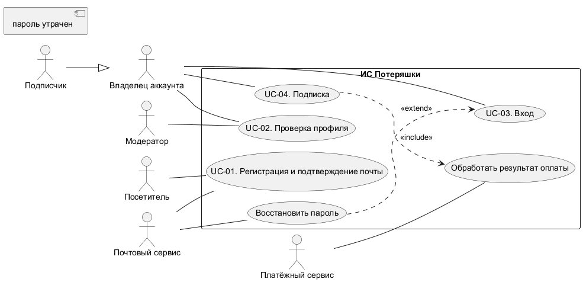

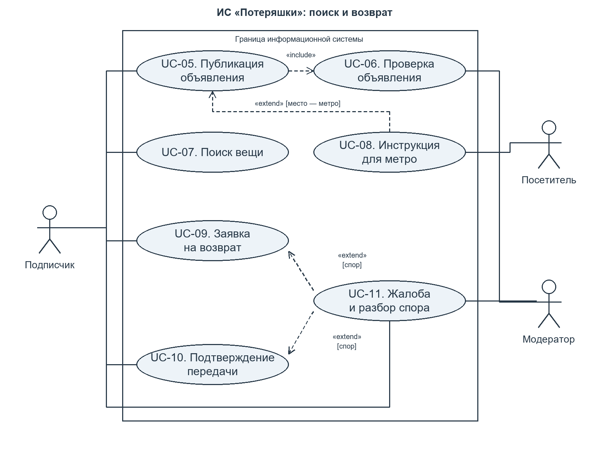

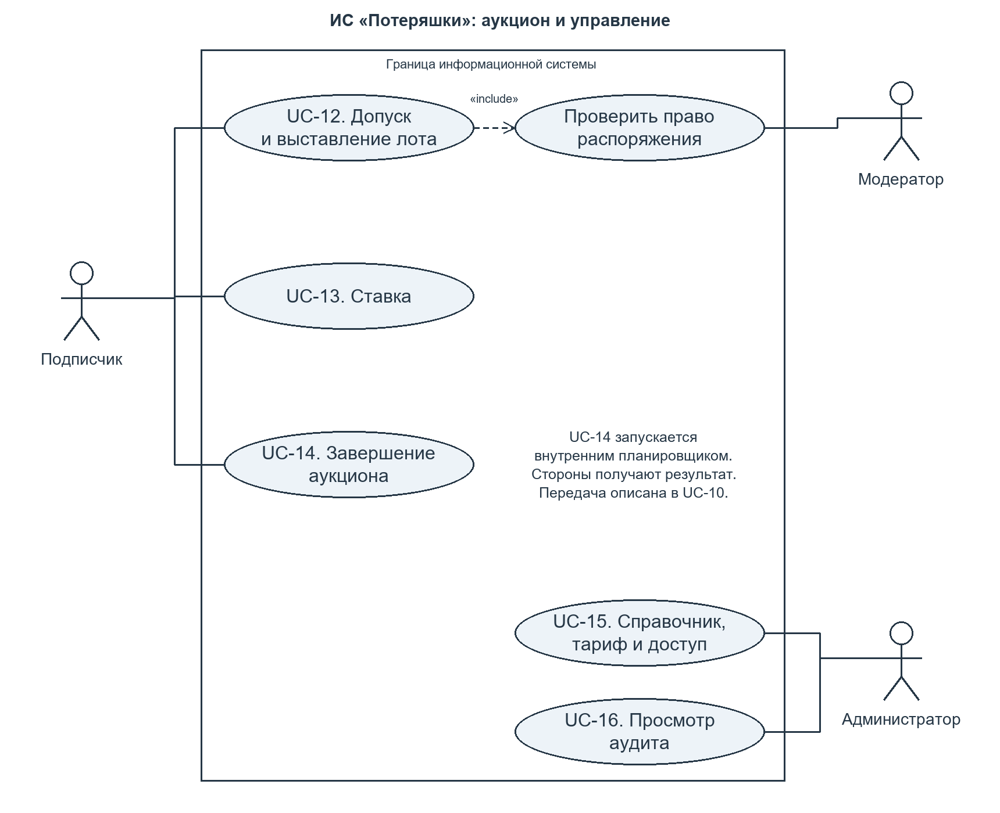

Диаграммы разбиты по процессам для читаемости; во всех трёх граница обозначает одну систему «Потеряшки». Далее описаны все показанные основные прецеденты UC-01–UC-16; включаемые технические действия раскрываются внутри сценариев.

### 5.2. UC-01. Зарегистрироваться и подтвердить почту

| Прецедент | UC-01 |
| --- | --- |
| ID | 1 |
| Краткое описание | Создать подтверждённую учётную запись. |
| Главный актёр | Посетитель |
| Второстепенные актёры | Почтовый сервис |
| Предусловия | Адрес ещё не зарегистрирован. |
| Триггер | Отправка формы регистрации. |
| Основной поток | 1. Посетитель вводит имя, email и пароль, принимает правила и условия обработки данных.<br>2. Система проверяет обязательность полей, уникальность email и пароль длиной не менее 10 символов.<br>3. Система сохраняет хеш пароля и неподтверждённый аккаунт, создаёт одноразовый токен на 24 часа.<br>4. Почтовый сервис получает письмо со ссылкой подтверждения.<br>5. Посетитель открывает ссылку; система проверяет токен и подтверждает почту. |
| Альтернативный поток | Занятый email — предлагается вход или восстановление; истёкший токен — повторная отправка; ошибка доставки — аккаунт остаётся неподтверждённым, повтор доступен не чаще раза в минуту. |
| Постусловия | Аккаунт существует, почта подтверждена, статус профиля «Не проверен». |
| Связанные требования | FR-01, NFR-04, NFR-07. |

Таблица 1 — Описание прецедента UC-01.

### 5.3. UC-02. Пройти проверку профиля

| Прецедент | UC-02 |
| --- | --- |
| ID | 2 |
| Краткое описание | Получить допуск к подписке. |
| Главный актёр | Владелец аккаунта |
| Второстепенные актёры | Модератор |
| Предусловия | Почта подтверждена, аккаунт не заблокирован. |
| Триггер | Подача профиля на рассмотрение. |
| Основной поток | 1. Пользователь заполняет профиль и подтверждает ознакомление с правилами публикации.<br>2. Система ставит заявку на проверку в очередь.<br>3. Модератор оценивает комплектность профиля и признаки злоупотреблений, при необходимости запрашивает уточнение.<br>4. Модератор принимает или отклоняет профиль с причиной.<br>5. Система сохраняет решение и уведомляет пользователя. |
| Альтернативный поток | Неполный профиль остаётся на исправлении; после отказа можно повторно подать исправленный профиль; явное злоупотребление приводит к блокировке. |
| Постусловия | Получено решение, при одобрении открыта покупка подписки. |
| Связанные требования | FR-02, FR-14, FR-20, BR-04. |

Таблица 2 — Описание прецедента UC-02.

### 5.4. UC-03. Войти или восстановить доступ

| Прецедент | UC-03 |
| --- | --- |
| ID | 3 |
| Краткое описание | Получить доступ к своему кабинету. |
| Главный актёр | Владелец аккаунта |
| Второстепенные актёры | Почтовый сервис |
| Предусловия | Аккаунт зарегистрирован. |
| Триггер | Отправка формы входа. |
| Основной поток | 1. Пользователь вводит email и пароль.<br>2. Система проверяет пароль и ограничения попыток, выдаёт access-токен JWT и refresh-токен.<br>3. Кабинет показывает статус проверки и подписки, разрешённые операции. |
| Альтернативный поток | **Расширение «Восстановить пароль»:** при утрате пароля пользователь запрашивает ссылку; система отвечает без раскрытия наличия аккаунта, выдаёт токен на 30 минут и отправляет письмо. По действующей ссылке пользователь задаёт новый пароль; токен погашается, прежние refresh-токены отзываются, версия токенов пользователя изменяется для аннулирования ранее выданных JWT.<br>Неверные данные — общий отказ; превышение лимита — временное ограничение. Заблокированный аккаунт может просматривать причину и обращаться по своему делу, но пользовательские действия закрыты. |
| Постусловия | Выданы токены доступа либо дан контролируемый отказ. |
| Связанные требования | FR-01, FR-04, NFR-04, NFR-07. |

Таблица 3 — Описание прецедента UC-03.

### 5.5. UC-04. Оформить или продлить подписку

| Прецедент | UC-04 |
| --- | --- |
| ID | 4 |
| Краткое описание | Получить доступ к пользовательским функциям на оплаченный срок. |
| Главный актёр | Владелец аккаунта |
| Второстепенные актёры | Платёжный сервис |
| Предусловия | Вход выполнен, профиль одобрен, блокировки нет. |
| Триггер | Выбор тарифа и подтверждение оплаты. |
| Основной поток | 1. Система показывает цену и срок, создаёт заказ со снимком условий тарифа.<br>2. Пользователь переходит в платёжную форму и выполняет оплату.<br>3. Платёжный сервис направляет подтверждённое серверное событие с ID заказа.<br>4. Система проверяет подлинность события, сумму и состояние заказа; включает обязательное действие «Обработать результат оплаты».<br>5. В транзакции отмечается оплата и однократно добавляются 30 суток по BR-09.<br>6. Пользователь получает уведомление и видит дату окончания подписки. |
| Альтернативный поток | Отказ или отмена не меняют подписку; переход браузера на страницу успеха без подтверждения сервиса не активирует доступ; повторный callback возвращает прежний результат; при задержке заказ остаётся ожидающим. |
| Постусловия | Подписка активна либо заказ сохраняет корректный неуспешный/ожидающий статус. |
| Связанные требования | FR-03, FR-04, NFR-08. |

Таблица 4 — Описание прецедента UC-04.

### 5.6. UC-05. Опубликовать объявление

| Прецедент | UC-05 |
| --- | --- |
| ID | 5 |
| Краткое описание | Сообщить о потере или находке. |
| Главный актёр | Подписчик |
| Второстепенные актёры | Модератор |
| Предусловия | Активная подписка, одобренный профиль. |
| Триггер | Создание объявления. |
| Основной поток | 1. Пользователь выбирает тип объявления и заполняет предмет, категорию, описание, место и время.<br>2. Для находки указывает хранение и закрытые контрольные признаки; при необходимости добавляет безопасные фотографии.<br>3. Система проверяет данные и файлы, сохраняет черновик.<br>4. Пользователь отправляет объявление на модерацию.<br>5. Выполняется включаемый UC-06; одобренное объявление публикуется, автор получает уведомление. |
| Альтернативный поток | **Расширение UC-08:** при выборе места «Метро» показывается инструкция обращения к организации. недопустимые поля — исправление формы; отказ модератора — причина и возможность исправить; истечение подписки до отправки — сохраняется черновик без публикации. |
| Постусловия | Опубликованная карточка либо черновик/отказ с причиной. |
| Связанные требования | FR-05–FR-07, FR-10, BR-05/06. |

Таблица 5 — Описание прецедента UC-05.

### 5.7. UC-06. Проверить объявление

| Прецедент | UC-06 |
| --- | --- |
| ID | 6 |
| Краткое описание | Исключить мусорные и небезопасные публикации. |
| Главный актёр | Модератор |
| Второстепенные актёры | — |
| Предусловия | Объявление отправлено на модерацию. |
| Триггер | Открытие элемента очереди. |
| Основной поток | 1. Модератор изучает содержание, фотографии, категорию и признаки дублирования.<br>2. Проверяет отсутствие открытых персональных данных и запрещённых материалов.<br>3. Одобряет, отклоняет либо возвращает на исправление с причиной.<br>4. Система фиксирует решение, публикует только одобренную версию и уведомляет автора. |
| Альтернативный поток | Повторное редактирование требует новой проверки; явное нарушение может вызвать служебную проверку пользователя. При конкурентном рассмотрении сохраняется только одно актуальное решение для версии. |
| Постусловия | Версия получила определённый статус. |
| Связанные требования | FR-07, FR-14, FR-20. |

Таблица 6 — Описание прецедента UC-06.

### 5.8. UC-07. Найти вещь

| Прецедент | UC-07 |
| --- | --- |
| ID | 7 |
| Краткое описание | Найти подходящие объявления. |
| Главный актёр | Подписчик |
| Второстепенные актёры | — |
| Предусловия | Доступ к каталогу разрешён. |
| Триггер | Открытие каталога или отправка фильтров. |
| Основной поток | 1. Пользователь задаёт текст, категорию, тип объявления, место и временной интервал.<br>2. Система проверяет фильтры, выбирает опубликованные активные объявления и возвращает страницу результатов.<br>3. Пользователь открывает карточку и видит публичные сведения и допустимые действия.<br>4. При реализации FR-09 система дополнительно показывает кандидатов совпадения с объяснением по категории, месту и времени. |
| Альтернативный поток | Нет результатов — сообщение и предложение расширить фильтры; ошибочный интервал — указание поля; подписка истекла — предложение продления. |
| Постусловия | Пользователь получил актуальную выдачу без закрытых признаков. |
| Связанные требования | FR-08, FR-09, NFR-01, NFR-05. |

Таблица 7 — Описание прецедента UC-07.

### 5.9. UC-08. Получить инструкцию для метро

| Прецедент | UC-08 |
| --- | --- |
| ID | 8 |
| Краткое описание | Узнать официальный маршрут обращения. |
| Главный актёр | Посетитель или подписчик |
| Второстепенные актёры | — |
| Предусловия | Выбрано место «Метро» либо открыта справочная страница. |
| Триггер | Запрос инструкции; при UC-05 — выбор метро. |
| Основной поток | 1. Система определяет организацию по городу и виду места.<br>2. Показывает телефон, официальный URL, порядок передачи/получения и дату проверки.<br>3. Пользователь может перейти на официальный сайт или воспользоваться телефоном. |
| Альтернативный поток | Нет записи — показывается отсутствие проверенной инструкции без выдуманных контактов; сведения старше 30 суток — отметка необходимости обновления и ссылка на источник; сайт недоступен — локальные сведения сохраняются. |
| Постусловия | Выдана инструкция; заявление в метро автоматически не отправляется. |
| Связанные требования | FR-10, NFR-15. |

Таблица 8 — Описание прецедента UC-08.

### 5.10. UC-09. Подать и рассмотреть заявку на возврат

| Прецедент | UC-09 |
| --- | --- |
| ID | 9 |
| Краткое описание | Установить получателя и согласовать выдачу. |
| Главный актёр | Подписчик, претендующий на находку |
| Второстепенные актёры | Автор объявления о находке |
| Предусловия | Находка опубликована, претендент не является автором. |
| Триггер | Отправка заявки. |
| Основной поток | 1. Претендент описывает индивидуальные признаки и при необходимости предоставляет закрытые доказательства.<br>2. Система создаёт заявку, уведомляет автора и открывает диалог сторон.<br>3. Автор сравнивает сведения со скрытыми признаками, запрашивает уточнения или отклоняет заявку с причиной.<br>4. При достаточных доказательствах автор принимает заявку.<br>5. Система в транзакции резервирует находку, стороны согласуют место и время передачи. |
| Альтернативный поток | Уже есть заявка того же участника — открывается существующая; другая заявка уже получила резерв — согласование не происходит; спор направляется в UC-11. Если для находки запланирован или начат аукцион, заявление владельца передаётся модератору, а торги приостанавливаются по BR-15. Если находка хранится в метро, претендент получает инструкцию, решение о выдаче принимает организация. |
| Постусловия | Отказ, уточнение либо единственное резервирование. |
| Связанные требования | FR-11, FR-12, FR-13, NFR-03. |

Таблица 9 — Описание прецедента UC-09.

### 5.11. UC-10. Подтвердить передачу вещи

| Прецедент | UC-10 |
| --- | --- |
| ID | 10 |
| Краткое описание | Зафиксировать состоявшийся возврат или передачу лота. |
| Главный актёр | Передающая сторона |
| Второстепенные актёры | Получающая сторона |
| Предусловия | Есть согласованная передача. |
| Триггер | Подтверждение одной из сторон. |
| Основной поток | 1. Передающая сторона отмечает факт передачи.<br>2. Получатель подтверждает получение.<br>3. Система проверяет принадлежность участников и оба подтверждения.<br>4. Находка становится возвращённой либо лот переданным; история сохраняется, стороны уведомляются. |
| Альтернативный поток | Только одно подтверждение — ожидание второго; отказ или расхождение — UC-11; отмена встречи до передачи снимает резерв. Истёкшая подписка не мешает завершить ранее согласованную передачу. По организации достаточно подтверждений участников информационного дела, но система не выдаёт документ от имени организации. |
| Постусловия | Передача закрыта либо остаётся в ожидании/споре. |
| Связанные требования | FR-13, FR-18, BR-03/08. |

Таблица 10 — Описание прецедента UC-10.

### 5.12. UC-11. Подать и разобрать жалобу

| Прецедент | UC-11 |
| --- | --- |
| ID | 11 |
| Краткое описание | Устранить нарушение либо разрешить спор. |
| Главный актёр | Участник дела |
| Второстепенные актёры | Модератор |
| Предусловия | Участник видит объект или является стороной существующего дела. |
| Триггер | Подача жалобы; расширяет UC-09/10 при споре. |
| Основной поток | 1. Участник выбирает причину, описывает проблему и прикладывает доступные доказательства.<br>2. Система сохраняет жалобу и направляет её модератору.<br>3. Модератор изучает материалы, при необходимости запрашивает уточнения у сторон.<br>4. Принимается решение: отклонить жалобу, скрыть публикацию, заблокировать пользователя, отменить резерв или приостановить торги.<br>5. Система сохраняет мотивированное решение, изменения и уведомления. |
| Альтернативный поток | Недостаточно материалов — запрос уточнений; вопрос требует компетентной организации — участникам даётся официальный маршрут обращения, дело не объявляется юридически разрешённым системой. |
| Постусловия | Решение зафиксировано либо дело ожидает уточнения. |
| Связанные требования | FR-15, FR-18, FR-20. |

Таблица 11 — Описание прецедента UC-11.

### 5.13. UC-12. Получить допуск и выставить лот

| Прецедент | UC-12 |
| --- | --- |
| ID | 12 |
| Краткое описание | Открыть торги допустимой вещью. |
| Главный актёр | Подписчик-продавец |
| Второстепенные актёры | Модератор |
| Предусловия | Продавец связан с находкой, нет действующего возврата или спора. |
| Триггер | Заявка на аукцион. |
| Основной поток | 1. Продавец указывает основание права распоряжения, дату официального заявления и подтверждающие материалы.<br>2. Включаемое действие «Проверить право распоряжения» проверяет комплектность и необходимые сроки; модератор рассматривает основание и ограничения категории.<br>3. При положительном решении система создаёт допуск, привязанный к находке и продавцу.<br>4. Продавец вводит стартовую цену, шаг, время начала и окончания.<br>5. Система проверяет положительность цены/шага и последовательность времени, сохраняет лот.<br>6. В момент начала система повторно проверяет допуск и отсутствие блокирующих обстоятельств, переводит лот в активное состояние. |
| Альтернативный поток | Нет основания либо срок не выполнен — отказ; вещь у метро — отказ обычному пользователю; открытая заявка владельца — приостановление; закончилась подписка до запуска — лот не запускается до продления. |
| Постусловия | Допущенный запланированный/активный лот либо отказ. |
| Связанные требования | FR-16, FR-17, BR-11. |

Таблица 12 — Описание прецедента UC-12.

### 5.14. UC-13. Сделать ставку

| Прецедент | UC-13 |
| --- | --- |
| ID | 13 |
| Краткое описание | Предложить цену за лот. |
| Главный актёр | Подписчик-покупатель |
| Второстепенные актёры | — |
| Предусловия | Аукцион активен, участник не продавец, подписка действительна. |
| Триггер | Отправка суммы ставки. |
| Основной поток | 1. Пользователь вводит сумму и подтверждает предложение.<br>2. Система блокирует строку аукциона в транзакции и повторно проверяет статус, время, права и актуальную минимальную цену.<br>3. Допустимая ставка сохраняется с серверным временем, текущий лидер обновляется.<br>4. Пользователь получает подтверждение, прежний лидер — уведомление. |
| Альтернативный поток | Ставка ниже минимума — отказ с актуальным значением; конкурентная ставка изменила минимум — запрос отклонён, интерфейс обновляется; срок истёк — отказ; повтор запроса с тем же ключом возвращает исходный результат. |
| Постусловия | Одна принятая ставка или контролируемый отказ. |
| Связанные требования | FR-17, NFR-02/03, BR-12/13. |

Таблица 13 — Описание прецедента UC-13.

### 5.15. UC-14. Завершить аукцион

| Прецедент | UC-14 |
| --- | --- |
| ID | 14 |
| Краткое описание | Определить итог торгов. |
| Главный актёр | Продавец — получатель результата |
| Второстепенные актёры | Участники аукциона — получатели результата |
| Предусловия | Наступило время окончания либо модератор принял решение об отмене. |
| Триггер | Внутреннее событие планировщика; внешние участники не запускают завершение произвольно. |
| Основной поток | 1. Планировщик выбирает аукционы с истёкшим сроком.<br>2. Система блокирует лот и проверяет, что завершение ещё не выполнено.<br>3. Для активного лота с принятыми ставками фиксируется победитель по наибольшей цене; без ставок фиксируется отсутствие победителя.<br>4. Система уведомляет стороны, для победителя и продавца открывает согласование передачи.<br>5. После фактической передачи выполняется UC-10. |
| Альтернативный поток | Приостановленный лот ожидает решения модератора и не получает победителя автоматически; после перезапуска пропущенные завершения обрабатываются; отказ победителя ведёт к отмене результата с причиной, без автоматического назначения второго участника. |
| Постусловия | Итог неизменяемо зафиксирован либо лот остаётся приостановленным. |
| Связанные требования | FR-18, FR-14, NFR-03/08. |

Таблица 14 — Описание прецедента UC-14.

### 5.16. UC-15. Управлять справочником, тарифом и доступом

| Прецедент | UC-15 |
| --- | --- |
| ID | 15 |
| Краткое описание | Поддерживать настройки системы. |
| Главный актёр | Администратор |
| Второстепенные актёры | — |
| Предусловия | Служебная авторизация. |
| Триггер | Выбор административной операции. |
| Основной поток | 1. Администратор выбирает пользователя, тариф либо организацию.<br>2. Вносит изменения: блокировка, служебная роль, цена нового заказа, контакты, инструкция и источник.<br>3. Система проверяет полномочия, корректность полей и обязательность причины для изменения доступа.<br>4. Изменение сохраняется и записывается в аудит. |
| Альтернативный поток | Цена уже созданного заказа не меняется; попытка удалить последнего администратора отклоняется; новая инструкция без источника не публикуется. Блокировка участника активных торгов передаётся модератору для решения по лоту. |
| Постусловия | Настройка изменена с историей. |
| Связанные требования | FR-19, FR-20, NFR-15. |

Таблица 15 — Описание прецедента UC-15.

### 5.17. UC-16. Просмотреть аудит

| Прецедент | UC-16 |
| --- | --- |
| ID | 16 |
| Краткое описание | Проверить действия и восстановить ход событий. |
| Главный актёр | Администратор |
| Второстепенные актёры | — |
| Предусловия | Служебные права чтения аудита. |
| Триггер | Запрос журнала. |
| Основной поток | 1. Администратор задаёт период, объект, исполнителя и тип события.<br>2. Система выдаёт подходящие записи постранично.<br>3. Администратор изучает время, действие, результат и технический ID связанного дела. |
| Альтернативный поток | Нет записей — пустая выдача; обычный пользователь или запрос на изменение записей — отказ. Полные доказательства, секреты и пароли в аудит не включаются. |
| Постусловия | Журнал просмотрен, сведения не изменены. |
| Связанные требования | FR-20, NFR-13. |

Таблица 16 — Описание прецедента UC-16.

## 6. Предлагаемая архитектура

### 6.1. Архитектурный подход и технологии

Система использует клиент-серверную архитектуру с монолитным Java-приложением. Spring MVC обрабатывает запросы и передаёт модели представления в HTML-шаблоны Thymeleaf. Браузер отправляет формы и получает готовые страницы. Прикладной слой разделён на модули предметной области, выполняет проверки доступа и управляет транзакциями. Java-стек выбран на основе backend проекта MyFilmList [7]; серверное формирование страниц поддерживается Spring MVC и Thymeleaf [8, 9].

| Уровень | Технологии | Назначение |
| --- | --- | --- |
| Backend | Java 17, Spring Boot, Spring MVC | REST API, прикладные сервисы, исполняемый JAR |
| Доступ | Spring Security, JWT, BCrypt | Аутентификация, проверка ролей, подписки и блокировки |
| Данные | PostgreSQL, Hibernate, Spring Data JPA, JDBC | Хранение сущностей, транзакции, вызов функций PL/pgSQL |
| Миграции | Flyway | Версионированное изменение схемы PostgreSQL |
| Файлы | MinIO, Java SDK MinIO | Закрытое объектное хранилище фотографий и материалов |
| Представление | Spring MVC, Thymeleaf, HTML, CSS | Формирование страниц и обработка форм |
| Состояние интерфейса | Модели представления Spring MVC | Результаты поиска, данные форм и ошибки проверки |
| Сборка | Java 17, Gradle Wrapper | Сборка приложения, тестов и средств сопровождения |
| Вспомогательные средства | Lombok, MapStruct, Springdoc OpenAPI | Модели, преобразование DTO, описание REST API |
| Проверки | JUnit, Spring Test, Spring Security Test | Проверка правил, доступа и взаимодействия с PostgreSQL |

Из MyFilmList приняты Java, Spring Boot, Hibernate/JPA, PostgreSQL, Lombok и Gradle. Пользовательский интерфейс проектируется на Thymeleaf: это позволяет хранить контроллеры и представления в одном приложении. Конкретные версии зависимостей фиксируются в build.gradle; backend использует Spring Boot 3.5, совместимый с Java 17 [5].

HTML-шаблоны размещаются в src/main/resources/templates, стили и изображения — в src/main/resources/static. Контроллеры Spring MVC вызывают прикладные сервисы и передают результат в Thymeleaf. Идентификатор карточки задаётся маршрутом запроса; новая находка появляется без пересборки приложения. Страницы, формы и REST API при необходимости обслуживаются одной JVM на helios [9].

Для браузера access-токен JWT передаётся в защищённой HttpOnly Cookie с ограниченным сроком действия. Refresh-токен также передаётся в защищённой Cookie, его хеш хранится в БД; при обновлении выполняется ротация. Выход и смена пароля отзывают refresh-токены, а версия токенов аккаунта позволяет аннулировать ранее выданные JWT. Состояние блокировки и подписки проверяется на backend независимо от содержимого токена. Все изменяющие состояние запросы с Cookie защищаются от CSRF; секреты аутентификации не передаются в HTML-модели.

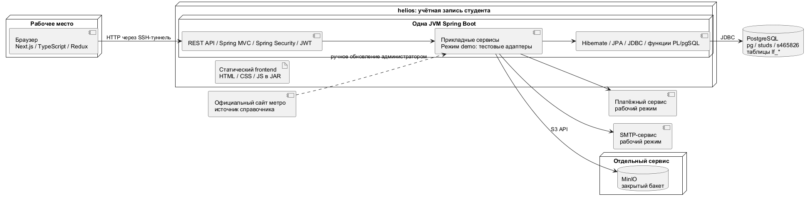

### 6.2. Модули и распределение ответственности

- **Учётные записи и доступ:** регистрация, почта, восстановление, проверка профилей, блокировки, подписки и единая проверка прав.
- **Платежи:** заказы, проверка результатов, идемпотентность, учебный и будущий реальный адаптеры.
- **Объявления и поиск:** карточки, места, фотографии, закрытые признаки, фильтры и кандидаты совпадения.
- **Возвраты и общение:** заявки, диалоги, резервирование, подтверждение передачи.
- **Справочник организаций:** метро, инструкции, официальные ссылки и даты проверки.
- **Аукционы:** допуски, лоты, ставки, итог и передача покупателю.
- **Модерация и администрирование:** очереди проверок, жалобы, служебные решения, роли и настройки.
- **Уведомления и аудит:** внутренние события, отправка писем, прослеживаемость операций.

В каждом модуле выделяются MVC-контроллеры, прикладные сервисы, доменные сущности и репозитории. REST-контроллер принимает запрос и проверяет формат, сервис применяет бизнес-правила и транзакции, репозиторий обращается к БД. Проверка подписки выполняется на сервере, а не только посредством скрытия кнопок. Внешние зависимости доступны через интерфейсы адаптеров, чтобы учебный режим не менял основную логику.

### 6.3. Хранение данных и транзакционные границы

Предлагаются таблицы пользователей, ролей, назначений ролей, токенов обновления, одноразовых токенов, проверок профиля, тарифов, подписок, заказов и событий оплаты, объявлений, категорий, изображений, контрольных признаков, мест, организаций, заявок владельцев, диалогов, сообщений, передач, жалоб, допусков к продаже, аукционов, ставок, уведомлений, событий доставки и аудита. Используются внешние ключи, уникальность email и внешнего ID платёжного события, проверки сумм и временных интервалов. Доступ к закрытым данным осуществляется через сервисы с проверкой участников.

Для поиска создаются индексы по типу/статусу, категории, времени и месту; для текстового поиска можно использовать возможности PostgreSQL. Полнотекстовый движок вне БД для объёма курсовой не требуется. Географический поиск в первой версии выполняется по городу, району и станции без обязательного PostGIS.

Оплата и продление подписки сохраняются в одной транзакции. Принятие заявки блокирует запись находки и проверяет отсутствие другого резерва или незавершённого аукциона. Запуск продажи использует ту же запись для проверки отсутствия действующего возврата. Ставка блокирует строку аукциона через SELECT FOR UPDATE и повторно проверяет условия внутри блокировки. Завершение использует ту же блокировку, поэтому ставка не проходит после фиксации итога. Для денег используется NUMERIC(12,2), для времени — timestamptz и серверные часы.

Критически важные операции — резервирование находки, приём ставки, завершение аукциона и активация подписки — предусматриваются как функции PL/pgSQL. Их определения, ограничения целостности, триггеры и тестовые данные разрабатываются на втором этапе. На третьем этапе слой хранения вызывает эти функции через JDBC или нативные запросы JPA; замена таких вызовов аналогичной реализацией в Java не допускается. Прикладные сервисы отвечают за проверку доступа, подготовку параметров и обработку результата. Связь пользователей и ролей моделируется отдельной таблицей user_roles и образует отношение «многие ко многим».

Существенное изменение и событие уведомления записываются вместе в транзакции через таблицу outbox_events. Фоновый обработчик доставляет событие и отмечает результат; устойчивый ключ предотвращает дублирование. При перезапуске недоставленные события и просроченные аукционы обрабатываются повторно безопасным способом.

Фотографии и подтверждающие материалы сохраняются в закрытом бакете MinIO под генерируемыми ключами. В PostgreSQL хранятся ключ объекта, тип, размер и права доступа. Изображения декодируются, проверяются и пересохраняются без EXIF. Spring-контроллер проверяет права и передаёт содержимое объекта пользователю; публичный доступ к бакету закрыт. Временные объекты, не связанные с записью БД после сбоя, удаляются фоновым заданием. Резервное копирование включает PostgreSQL и объекты MinIO.

### 6.4. Внешние интеграции и учебные адаптеры

PaymentGateway имеет операции создания оплаты, проверки серверного события и получения статуса заказа. DemoPaymentGateway позволяет показать успех, отказ, задержку и повтор события без реальных денег. Его управляющие операции доступны только в демонстрационном профиле и служебному пользователю. Реальный провайдер и его протокол выбираются позже; подлинность callback и сумма проверяются по спецификации выбранного провайдера.

На helios демонстрационный платёж не требует входящего соединения от внешнего сервиса: событие создаётся внутри приложения служебным действием. Для реального провайдера понадобится доступная HTTPS-точка приёма, которую SSH-туннель преподавателя не обеспечивает. Наличие этой точки на учебном сервере не предполагается.

MailGateway отделяет отправку писем от доменных операций. Для демонстрации можно использовать учебный SMTP-стенд либо доступные служебному оператору тестовые ссылки для синтетических аккаунтов. В реальном профиле ссылки не выводятся в журнал и не доступны администратору через тестовые команды.

MetroDirectoryProvider в первой версии читает проверенные записи из PostgreSQL. Официальный сайт — источник для ручного обновления администратором. Живой запрос к сайту метро при каждой карточке не нужен; это уменьшает зависимость от внешней доступности.

### 6.5. Развёртывание и демонстрация на helios

Демонстрация приложения проводится на helios. Этот сервер также используется для запуска Java-программ в учебных заданиях кафедры [6]. Развёртывание выполняется в выделенной учётной записи с учётом доступной версии Java, квот памяти и дискового пространства.

Проверка окружения 03.10.2026 показала: helios работает под FreeBSD 14.5-STABLE, доступны OpenJDK 21.0.4 и PostgreSQL 18.3. Сборка с целевой Java 17 может выполняться на установленной Java 21. Для запуска JVM необходимо явно ограничивать размер heap; команда java -Xmx256m -version выполняется успешно. Приложение и MinIO развёртываются на последующих этапах; доступность порта приложения и файлового сервиса проверяется перед запуском.

База данных studs общая. Учётная запись s465826 имеет право создавать объекты в своей схеме s465826, но не может создавать новые схемы или базы данных. Поэтому объекты курсовой получают префикс lf_ и размещаются отдельно от таблиц лабораторной по именам. Каталог файлов курсовой — ~/poteryashki-course. Локально PostgreSQL, MinIO и почтовый стенд могут запускаться через Docker Compose, как в MyFilmList.

Приложение собирается локально Gradle Wrapper: ./gradlew test bootJar :tooling:toolJar. Шаблоны Thymeleaf и статические ресурсы включаются в исполняемый JAR при добавлении интерфейса. На helios передаются JAR, конфигурация и SQL-скрипты. Средства сборки отчётов, проверки PostgreSQL и установки представлены отдельным Java-модулем tooling.

В каталоге ~/poteryashki-course предусматриваются подкаталоги app, config, logs и backups. Адрес PostgreSQL, схема, endpoint MinIO, имя бакета и параметры почты задаются через конфигурацию. Пароли, ключи JWT и учётные данные MinIO не включаются в репозиторий и не передаются в аргументах командной строки. Для резервного копирования общей схемы выбираются только объекты lf_*; копия для восстановления также включает объекты бакета курсовой.

Пример запуска после реализации веб-слоя и настройки порта: java -Xms128m -Xmx256m -jar poteryashki.jar --spring.profiles.active=demo --server.address=127.0.0.1 --server.port=PORT. Значение PORT заменяется выделенным числом, предел памяти проверяется по квоте и результатам запуска. Для просмотра используется SSH-перенаправление: ssh -L 18080:127.0.0.1:PORT USER@HOST. Если SSH работает на нестандартном порту, добавляется -p SSH_PORT. Браузер открывает http://127.0.0.1:18080; страницы Thymeleaf и REST API обслуживаются приложением на helios.

Если MinIO расположен на машине разработчика и недоступен с helios напрямую, для демонстрации может использоваться разрешённое сервером обратное SSH-перенаправление его API-порта. В этом случае backend обращается к endpoint на loopback-адресе helios. Доступность MinIO и возможность такого перенаправления проверяются до показа; работоспособность загрузки, чтения и резервного копирования объектов входит в подготовку стенда. Запуск самого MinIO на helios не предполагается без проверки совместимости.

Тестовый платёжный адаптер работает внутри backend, а справочник метро читается из PostgreSQL. При завершении демонстрации приложение и временные туннели останавливаются. Выделенная схема PostgreSQL и бакет MinIO управляются только в пределах предоставленных прав.

### 6.6. План демонстрации последующих этапов

1. Показать запуск приложения на helios, активный профиль demo, схему PostgreSQL и доступ через SSH-туннель.
2. Зарегистрировать синтетического пользователя; показать подтверждение почты, ожидание и решение модератора.
3. Показать отказ в доступе до подписки, учебную успешную оплату и повтор события без двойного продления.
4. Создать находку с местом и временем, показать закрытые признаки, модерацию и появление в каталоге.
5. Выбрать станцию метро и показать официальный контакт и маршрут обращения.
6. Вторым пользователем найти вещь, подать заявку, согласовать резерв и подтвердить возврат двумя сторонами.
7. Для тестовой находки показать отказ в аукционе без подтверждающих материалов, затем допуск, приём ставок и итог торгов. В тестовом наборе используются даты, позволяющие проверить соблюдение установленного срока.
8. Показать конкурентные ставки, отказ после срока, аукцион без ставок, жалобу, приостановление и запись аудита.
9. Показать истечение подписки: новые действия закрыты, ранее согласованный возврат можно завершить.

## Вывод

Определена предметная область ИС «Потеряшки», описаны процессы публикации, поиска, возврата, подписки, модерации, справочной интеграции с метро и аукциона. Сформулированы проверяемые требования и бизнес-правила, построены модели основных прецедентов и даны их сценарии. Предложена клиент-серверная архитектура: Java 17, Spring Boot, Spring MVC и Thymeleaf, PostgreSQL для структурированных данных и MinIO для файлов. На helios размещается Spring-приложение с шаблонами интерфейса.

Второй этап включает ER-модель, даталогическую модель, схему PostgreSQL, ограничения и триггеры, тестовые данные, функции PL/pgSQL и индексы. Реализация интерфейса и серверного приложения относится к последующим этапам.

## Список использованных источников

Дата проверки источников: 03.10.2026. Контакты и условия организации подлежат повторной проверке перед эксплуатацией. Все проектные требования и численные цели сформулированы для данной курсовой; они не являются требованиями метрополитена.

1. Петербургский метрополитен. Справочная о забытых вещах. Официальный источник порядка хранения и получения: https://metro.spb.ru/zabitieveshy.html?v=1
2. Петербургский метрополитен. Контакты. Проверка телефона информационно-справочного центра: https://metro.spb.ru/contacts.html
3. Гражданский кодекс Российской Федерации, часть первая, статья 227 «Находка». Текст нормы в СПС «КонсультантПлюс»: https://www.consultant.ru/document/cons_doc_LAW_5142/b3526f37d7093a56bf084817caeee175f032a3d7/
4. Гражданский кодекс Российской Федерации, часть первая, статья 228 «Приобретение права собственности на находку». Текст нормы в СПС «КонсультантПлюс»: https://www.consultant.ru/document/cons_doc_LAW_5142/104dea7aa78d4c2e927d3baed4e96d5ace10e692/
5. Spring. Spring Boot 3.5 — System Requirements. Официальная документация: https://docs.spring.io/spring-boot/3.5/system-requirements.html
6. Кафедра ВТ, Университет ИТМО. Программирование. Публичные задания с демонстрацией Java-программ на helios: https://se.ifmo.ru/courses/programming
7. MyFilmList. Backend, build.gradle, версия 74d1928973cae329d6ca651bac2ffde445a43de0: https://github.com/maxbarsukov/MyFilmList/blob/74d1928973cae329d6ca651bac2ffde445a43de0/build.gradle
8. Spring Framework. Thymeleaf: https://docs.spring.io/spring-framework/reference/web/webmvc-view/mvc-thymeleaf.html
9. Thymeleaf. Интеграция со Spring: https://www.thymeleaf.org/doc/tutorials/3.1/thymeleafspring.html

## Приложение А. Термины

| Термин | Определение |
| --- | --- |
| Верификация профиля | Подтверждение почты и решение модератора о допуске аккаунта; не паспортная идентификация |
| Подписка | Оплаченный период доступа к пользовательским функциям |
| Контрольный признак | Непубличная характеристика вещи для проверки претендента |
| Резервирование | Согласование выдачи одной находки одному претенденту |
| Справочная интеграция | Подбор проверенных контактов и инструкций организации без обмена её внутренними данными |
| Допуск аукциона | Решение модератора по материалам основания распоряжения вещью |
| Идемпотентность | Повтор запроса или события не создаёт повторный результат операции |
| RPO | Допустимая потеря данных по времени относительно сбоя |
| RTO | Целевое время восстановления работы |
| Outbox | Таблица событий, записываемых вместе с бизнес-операцией для последующей надёжной доставки |

## Приложение Б. План проверки требований

| Пункт задания | Раздел отчёта | Результат |
| --- | --- | --- |
| 1. Выбор предметной области | 1–2 | Поиск и возврат потерянных вещей в городской среде |
| 2. Подробное текстовое описание | 2 | Участники, процессы, данные, статусы, бизнес-правила |
| 3. Зачем нужна система и какие задачи решает | 3 | Цель, проблемы и задачи автоматизации |
| 4. Функциональные/нефункциональные требования | 4 | FR-01–FR-20, NFR-01–NFR-16 и критерии проверки |
| 5. Модели и описания прецедентов | 5 | Три UML-диаграммы, 16 описаний прецедентов |
| 6. Архитектура, технологии и helios | 6 | Java/Spring MVC/Thymeleaf, Hibernate, PostgreSQL/MinIO; план развёртывания |
| 7. Отчёт | Весь документ | Результаты анализа предметной области и проектирования системы |

| Группа требований | Прецеденты | Проверка на этапе реализации |
| --- | --- | --- |
| Аккаунты и подписка: FR-01–04 | UC-01–04 | Проверка почты, служебное решение, оплата/отказ/повтор события, прямой запрос без доступа |
| Объявления и поиск: FR-05–09 | UC-05–07 | Обязательные поля, файлы, закрытые признаки, повторная модерация и комбинированный поиск |
| Метро: FR-10 | UC-08 | Станция, официальный контакт и источник, дата проверки, отсутствие записи |
| Возврат: FR-11–13 | UC-09–10 | Заявки, чужой доступ к диалогу, конкурирующие резервы, два подтверждения |
| Уведомления и споры: FR-14–15 | UC-02–14 | Решения и сообщения в кабинете, сбой почты, жалоба с причиной и результатом |
| Аукцион: FR-16–18 | UC-12–14 | Допуск, продавец не ставит, конкуренция, граница времени, отсутствие ставок и приостановление |
| Управление и аудит: FR-19–20 | UC-15–16 и служебные операции | Права сотрудников, изменение тарифа для новых заказов, отсутствие секретов и запрет изменения аудита |

Для NFR-01/02 предусматривается нагрузочная проверка; для NFR-03 — интеграционные тесты конкурентных транзакций на PostgreSQL; для NFR-04–08 и NFR-13 — проверки доступа, ввода и отказов адаптеров. NFR-09 проверяется восстановлением, NFR-10/11 — пользовательскими сценариями и размерами экрана, NFR-12/14 — сборкой и запуском, NFR-15 — просроченной записью справочника, NFR-16 — обезличиванием тестового профиля. Проверки проводятся после реализации соответствующих функций.

## 7. ER-модель базы данных

### 7.1. Сущности и связи

Модель построена по процессам и прецедентам первого этапа и содержит 27 сущностей: пользователи, роли, назначения ролей, проверки профилей, одноразовые токены, токены обновления, тарифы, заказы оплаты, платёжные события, периоды подписки, организации, места, категории, объявления, изображения, контрольные признаки, заявки на передачу, диалоги, сообщения, передачи, жалобы, допуски к продаже, аукционы, ставки, уведомления, события доставки и записи аудита.

Пользователь может иметь несколько ролей, а одна роль назначается нескольким пользователям. Отношение «многие ко многим» реализовано ассоциативной сущностью «Назначение роли»: lf_user_roles(user_id, role_code). Составной первичный ключ исключает повторное назначение одной роли пользователю.

Объявление принадлежит одному автору, одной категории и одному месту. Место может быть связано с организацией, предоставляющей справочную информацию. Организация-хранитель находки задаётся отдельно: событие могло произойти в одном месте, а вещь передана другой организации. Поле custodian_org_id не означает партнёрство организации с приложением.

Заявка связывает находку с претендентом. У находки может быть несколько заявок, но один действующий резерв. Диалог и передача относятся к конкретной заявке; участники определяются через автора объявления и заявителя. Необязательный auction_id с внешним ключом и UNIQUE связывает дело передачи с завершённым аукционом: одному аукциону соответствует не более одного такого дела. Допуск к продаже относится к находке и продавцу; каждый аукцион использует конкретный допуск. Это исключает подстановку разрешения для другой вещи. Всего модель содержит 42 внешних ключа.

Заказ оплаты фиксирует стоимость и длительность тарифа на момент создания. Изменение справочника тарифов не меняет уже созданный заказ. Внешние события оплаты отделены от периодов подписки, поскольку платёжный сервис может повторить событие. Одному оплаченному заказу соответствует не более одного периода.

Уведомление адресовано пользователю. Событие доставки содержит тип агрегата, его идентификатор и JSON-параметры; эта техническая очередь не имеет универсального внешнего ключа на разные таблицы. Аудит хранит таблицу и идентификатор изменённой сущности. Его actor_id может быть NULL для фоновой операции.

### 7.2. Диаграммы

Модель разделена на шесть листов для чтения в формате A4. Листы показывают основные связи и их мощности; повтор сущности на разных листах не означает дополнительную таблицу. Полный перечень внешних ключей и атрибутов приведён в даталогической модели и словаре отношений. Обозначения: 1 — ровно один, 0..1 — необязательный экземпляр, 0..N — множество.


Редактируемая концептуальная модель находится в docs/part2/model/er.mmd, полная даталогическая схема — в logical.mmd. Формат Mermaid поддерживает отображение ER-диаграмм и связей с ключами. Изображения каждого листа предоставлены в PNG и SVG.

## 8. Даталогическая модель

### 8.1. Преобразование ER-модели

Каждая сущность преобразована в таблицу PostgreSQL. Основные идентификаторы — bigint GENERATED BY DEFAULT AS IDENTITY; код роли является естественным ключом. Для ассоциации пользователей и ролей выбран составной ключ. Связи 1:N реализованы внешними ключами; для связей 1:0..1 добавлено UNIQUE: заявка — диалог, заявка — передача и заказ оплаты — период подписки.

Модель приведена к третьей нормальной форме. Атрибуты пользователя не копируются в объявления, диалоги и ставки. Сведения о категории, месте, организации и тарифе вынесены в справочники. Составной ключ назначения роли не содержит атрибутов, зависящих только от одной его части. Снимок суммы и длительности в заказе относится к самому заказу и необходим для сохранения условий оплаты, поэтому не заменяется ссылкой на текущие значения тарифа.

Время хранится в timestamptz. Начало события обязательно; event_until задаётся только для интервала потери. Денежные значения используют numeric(12,2), без float. Закрытые признаки хранятся в lf_private_attributes и отсутствуют в публичном представлении. Файлы представлены ключами объектов MinIO; бинарные данные не записываются в PostgreSQL. Технические JSON-поля применяются только в очереди событий и аудите, а связи предметной области остаются реляционными.

Циклическая связь аукциона и выигравшей ставки реализована составным внешним ключом (id, winner_bid_id) → lf_bids(auction_id, id), отложенным до завершения транзакции. Победитель не может относиться к другому аукциону. Отложенная проверка резерва позволяет в одной транзакции согласовать заявку и изменить статус объявления. Физический столбец search_vector является контролируемой избыточностью для поиска: PostgreSQL вычисляет его из текста объявления автоматически; в концептуальной нормализованной модели этот атрибут не требуется.

Словарь отношений сформирован из системного каталога PostgreSQL после установки на helios. Он отражает реально созданные типы, возможность NULL, первичные и внешние ключи. Отдельные частичные уникальные индексы описаны в разделе 13.

### 8.2. Словарь отношений

#### 1. Допуск к продаже: lf_auction_permissions

| Поле | Тип PostgreSQL | NULL | Ключ |
| --- | --- | --- | --- |
| id | bigint | Нет | PK |
| listing_id | bigint | Нет | FK |
| applicant_id | bigint | Нет | FK |
| basis | varchar(20) | Нет | — |
| evidence_object_key | varchar(240) | Нет | — |
| state | varchar(12) | Нет | — |
| moderator_id | bigint | Да | FK |
| reviewed_at | timestamptz | Да | — |
| reason | text | Да | — |
| created_at | timestamptz | Нет | — |

FOREIGN KEY (applicant_id) REFERENCES lf_users(id).

UNIQUE (id, listing_id, applicant_id).

FOREIGN KEY (listing_id) REFERENCES lf_listings(id).

FOREIGN KEY (moderator_id) REFERENCES lf_users(id).

PRIMARY KEY (id).

#### 2. Аукцион: lf_auctions

| Поле | Тип PostgreSQL | NULL | Ключ |
| --- | --- | --- | --- |
| id | bigint | Нет | PK, FK |
| listing_id | bigint | Нет | FK |
| seller_id | bigint | Нет | FK |
| permission_id | bigint | Нет | FK |
| starts_at | timestamptz | Нет | — |
| ends_at | timestamptz | Нет | — |
| start_price | numeric(12,2) | Нет | — |
| bid_step | numeric(12,2) | Нет | — |
| state | varchar(12) | Нет | — |
| winner_bid_id | bigint | Да | FK |
| closed_at | timestamptz | Да | — |

FOREIGN KEY (listing_id) REFERENCES lf_listings(id).

FOREIGN KEY (permission_id, listing_id, seller_id) REFERENCES lf_auction_permissions(id, listing_id, applicant_id).

PRIMARY KEY (id).

FOREIGN KEY (seller_id) REFERENCES lf_users(id).

FOREIGN KEY (id, winner_bid_id) REFERENCES lf_bids(auction_id, id) DEFERRABLE INITIALLY DEFERRED.

#### 3. Запись аудита: lf_audit_entries

| Поле | Тип PostgreSQL | NULL | Ключ |
| --- | --- | --- | --- |
| id | bigint | Нет | PK |
| actor_id | bigint | Да | FK |
| action | varchar(80) | Нет | — |
| entity_table | varchar(80) | Нет | — |
| entity_id | bigint | Нет | — |
| details | jsonb | Нет | — |
| created_at | timestamptz | Нет | — |

FOREIGN KEY (actor_id) REFERENCES lf_users(id).

PRIMARY KEY (id).

#### 4. Ставка: lf_bids

| Поле | Тип PostgreSQL | NULL | Ключ |
| --- | --- | --- | --- |
| id | bigint | Нет | PK |
| auction_id | bigint | Нет | FK |
| bidder_id | bigint | Нет | FK |
| request_key | uuid | Нет | — |
| amount | numeric(12,2) | Нет | — |
| placed_at | timestamptz | Нет | — |

FOREIGN KEY (auction_id) REFERENCES lf_auctions(id).

UNIQUE (auction_id, id).

FOREIGN KEY (bidder_id) REFERENCES lf_users(id).

PRIMARY KEY (id).

UNIQUE (request_key).

#### 5. Категория: lf_categories

| Поле | Тип PostgreSQL | NULL | Ключ |
| --- | --- | --- | --- |
| id | bigint | Нет | PK |
| name | varchar(80) | Нет | — |
| auction_allowed | boolean | Нет | — |

UNIQUE (name).

PRIMARY KEY (id).

#### 6. Заявка на передачу: lf_claims

| Поле | Тип PostgreSQL | NULL | Ключ |
| --- | --- | --- | --- |
| id | bigint | Нет | PK |
| listing_id | bigint | Нет | FK |
| claimant_id | bigint | Нет | FK |
| evidence | text | Нет | — |
| state | varchar(12) | Нет | — |
| created_at | timestamptz | Нет | — |
| auction_id | bigint | Да | FK |

FOREIGN KEY (auction_id) REFERENCES lf_auctions(id).

UNIQUE (auction_id).

FOREIGN KEY (claimant_id) REFERENCES lf_users(id).

UNIQUE (id, listing_id).

FOREIGN KEY (listing_id) REFERENCES lf_listings(id).

PRIMARY KEY (id).

#### 7. Жалоба: lf_complaints

| Поле | Тип PostgreSQL | NULL | Ключ |
| --- | --- | --- | --- |
| id | bigint | Нет | PK |
| reporter_id | bigint | Нет | FK |
| listing_id | bigint | Да | FK |
| reported_user_id | bigint | Да | FK |
| reason | text | Нет | — |
| state | varchar(12) | Нет | — |
| moderator_id | bigint | Да | FK |
| resolution | text | Да | — |
| created_at | timestamptz | Нет | — |

FOREIGN KEY (listing_id) REFERENCES lf_listings(id).

FOREIGN KEY (moderator_id) REFERENCES lf_users(id).

PRIMARY KEY (id).

FOREIGN KEY (reported_user_id) REFERENCES lf_users(id).

FOREIGN KEY (reporter_id) REFERENCES lf_users(id).

#### 8. Диалог: lf_conversations

| Поле | Тип PostgreSQL | NULL | Ключ |
| --- | --- | --- | --- |
| id | bigint | Нет | PK |
| claim_id | bigint | Нет | FK |
| created_at | timestamptz | Нет | — |

FOREIGN KEY (claim_id) REFERENCES lf_claims(id).

UNIQUE (claim_id).

PRIMARY KEY (id).

#### 9. Изображение: lf_listing_images

| Поле | Тип PostgreSQL | NULL | Ключ |
| --- | --- | --- | --- |
| id | bigint | Нет | PK |
| listing_id | bigint | Нет | FK |
| object_key | varchar(240) | Нет | — |
| media_type | varchar(20) | Нет | — |
| size_bytes | integer | Нет | — |
| position | smallint | Нет | — |

FOREIGN KEY (listing_id) REFERENCES lf_listings(id) ON DELETE CASCADE.

UNIQUE (listing_id, "position").

UNIQUE (object_key).

PRIMARY KEY (id).

#### 10. Объявление: lf_listings

| Поле | Тип PostgreSQL | NULL | Ключ |
| --- | --- | --- | --- |
| id | bigint | Нет | PK |
| author_id | bigint | Нет | FK |
| category_id | bigint | Нет | FK |
| location_id | bigint | Нет | FK |
| kind | varchar(5) | Нет | — |
| title | varchar(120) | Нет | — |
| description | text | Нет | — |
| event_at | timestamptz | Нет | — |
| event_until | timestamptz | Да | — |
| state | varchar(12) | Нет | — |
| custodian_org_id | bigint | Да | FK |
| official_reported_at | timestamptz | Да | — |
| moderator_id | bigint | Да | FK |
| moderated_at | timestamptz | Да | — |
| created_at | timestamptz | Нет | — |
| search_vector | tsvector | Да | — |

FOREIGN KEY (author_id) REFERENCES lf_users(id).

FOREIGN KEY (category_id) REFERENCES lf_categories(id).

FOREIGN KEY (custodian_org_id) REFERENCES lf_organizations(id).

FOREIGN KEY (location_id) REFERENCES lf_locations(id).

FOREIGN KEY (moderator_id) REFERENCES lf_users(id).

PRIMARY KEY (id).

#### 11. Место: lf_locations

| Поле | Тип PostgreSQL | NULL | Ключ |
| --- | --- | --- | --- |
| id | bigint | Нет | PK |
| city | varchar(80) | Нет | — |
| description | varchar(240) | Нет | — |
| latitude | numeric(9,6) | Да | — |
| longitude | numeric(9,6) | Да | — |
| metro_station | varchar(100) | Да | — |
| organization_id | bigint | Да | FK |

FOREIGN KEY (organization_id) REFERENCES lf_organizations(id).

PRIMARY KEY (id).

#### 12. Сообщение: lf_messages

| Поле | Тип PostgreSQL | NULL | Ключ |
| --- | --- | --- | --- |
| id | bigint | Нет | PK |
| conversation_id | bigint | Нет | FK |
| sender_id | bigint | Нет | FK |
| body | text | Нет | — |
| sent_at | timestamptz | Нет | — |

FOREIGN KEY (conversation_id) REFERENCES lf_conversations(id).

PRIMARY KEY (id).

FOREIGN KEY (sender_id) REFERENCES lf_users(id).

#### 13. Уведомление: lf_notifications

| Поле | Тип PostgreSQL | NULL | Ключ |
| --- | --- | --- | --- |
| id | bigint | Нет | PK |
| user_id | bigint | Нет | FK |
| kind | varchar(40) | Нет | — |
| body | text | Нет | — |
| read_at | timestamptz | Да | — |
| created_at | timestamptz | Нет | — |

PRIMARY KEY (id).

FOREIGN KEY (user_id) REFERENCES lf_users(id).

#### 14. Организация: lf_organizations

| Поле | Тип PostgreSQL | NULL | Ключ |
| --- | --- | --- | --- |
| id | bigint | Нет | PK |
| name | varchar(160) | Нет | — |
| phone | varchar(40) | Нет | — |
| address | text | Да | — |
| instructions | text | Нет | — |
| source_url | text | Нет | — |
| verified_on | date | Нет | — |

UNIQUE (name).

PRIMARY KEY (id).

#### 15. Событие доставки: lf_outbox_events

| Поле | Тип PostgreSQL | NULL | Ключ |
| --- | --- | --- | --- |
| id | bigint | Нет | PK |
| kind | varchar(40) | Нет | — |
| aggregate_id | bigint | Нет | — |
| payload | jsonb | Нет | — |
| attempts | integer | Нет | — |
| next_attempt_at | timestamptz | Нет | — |
| delivered_at | timestamptz | Да | — |
| created_at | timestamptz | Нет | — |

PRIMARY KEY (id).

#### 16. Событие оплаты: lf_payment_events

| Поле | Тип PostgreSQL | NULL | Ключ |
| --- | --- | --- | --- |
| provider_event_id | varchar(100) | Нет | PK |
| order_id | bigint | Нет | FK |
| amount | numeric(12,2) | Нет | — |
| currency | char(3) | Нет | — |
| received_at | timestamptz | Нет | — |

FOREIGN KEY (order_id) REFERENCES lf_payment_orders(id).

PRIMARY KEY (provider_event_id).

#### 17. Заказ оплаты: lf_payment_orders

| Поле | Тип PostgreSQL | NULL | Ключ |
| --- | --- | --- | --- |
| id | bigint | Нет | PK |
| user_id | bigint | Нет | FK |
| tariff_id | bigint | Нет | FK |
| request_key | uuid | Нет | — |
| amount | numeric(12,2) | Нет | — |
| duration_days | integer | Нет | — |
| currency | char(3) | Нет | — |
| state | varchar(12) | Нет | — |
| created_at | timestamptz | Нет | — |
| paid_at | timestamptz | Да | — |

PRIMARY KEY (id).

UNIQUE (request_key).

FOREIGN KEY (tariff_id) REFERENCES lf_tariffs(id).

FOREIGN KEY (user_id) REFERENCES lf_users(id).

#### 18. Контрольный признак: lf_private_attributes

| Поле | Тип PostgreSQL | NULL | Ключ |
| --- | --- | --- | --- |
| id | bigint | Нет | PK |
| listing_id | bigint | Нет | FK |
| name | varchar(80) | Нет | — |
| value | text | Нет | — |

FOREIGN KEY (listing_id) REFERENCES lf_listings(id) ON DELETE CASCADE.

UNIQUE (listing_id, name).

PRIMARY KEY (id).

#### 19. Токен обновления: lf_refresh_tokens

| Поле | Тип PostgreSQL | NULL | Ключ |
| --- | --- | --- | --- |
| id | bigint | Нет | PK |
| user_id | bigint | Нет | FK |
| token_hash | varchar(64) | Нет | — |
| expires_at | timestamptz | Нет | — |
| revoked_at | timestamptz | Да | — |
| created_at | timestamptz | Нет | — |

PRIMARY KEY (id).

UNIQUE (token_hash).

FOREIGN KEY (user_id) REFERENCES lf_users(id).

#### 20. Роль: lf_roles

| Поле | Тип PostgreSQL | NULL | Ключ |
| --- | --- | --- | --- |
| code | varchar(16) | Нет | PK |
| title | varchar(80) | Нет | — |

PRIMARY KEY (code).

#### 21. Период подписки: lf_subscriptions

| Поле | Тип PostgreSQL | NULL | Ключ |
| --- | --- | --- | --- |
| id | bigint | Нет | PK |
| user_id | bigint | Нет | FK |
| payment_order_id | bigint | Нет | FK |
| starts_at | timestamptz | Нет | — |
| ends_at | timestamptz | Нет | — |

FOREIGN KEY (payment_order_id) REFERENCES lf_payment_orders(id).

UNIQUE (payment_order_id).

PRIMARY KEY (id).

FOREIGN KEY (user_id) REFERENCES lf_users(id).

#### 22. Тариф: lf_tariffs

| Поле | Тип PostgreSQL | NULL | Ключ |
| --- | --- | --- | --- |
| id | bigint | Нет | PK |
| title | varchar(80) | Нет | — |
| amount | numeric(12,2) | Нет | — |
| duration_days | integer | Нет | — |
| active | boolean | Нет | — |

PRIMARY KEY (id).

#### 23. Передача: lf_transfers

| Поле | Тип PostgreSQL | NULL | Ключ |
| --- | --- | --- | --- |
| id | bigint | Нет | PK |
| claim_id | bigint | Нет | FK |
| finder_confirmed_at | timestamptz | Да | — |
| owner_confirmed_at | timestamptz | Да | — |
| moderator_id | bigint | Да | FK |
| override_reason | text | Да | — |
| completed_at | timestamptz | Да | — |

FOREIGN KEY (claim_id) REFERENCES lf_claims(id).

UNIQUE (claim_id).

FOREIGN KEY (moderator_id) REFERENCES lf_users(id).

PRIMARY KEY (id).

#### 24. Назначение роли: lf_user_roles

| Поле | Тип PostgreSQL | NULL | Ключ |
| --- | --- | --- | --- |
| user_id | bigint | Нет | PK, FK |
| role_code | varchar(16) | Нет | PK, FK |

PRIMARY KEY (user_id, role_code).

FOREIGN KEY (role_code) REFERENCES lf_roles(code) ON DELETE RESTRICT.

FOREIGN KEY (user_id) REFERENCES lf_users(id) ON DELETE RESTRICT.

#### 25. Пользователь: lf_users

| Поле | Тип PostgreSQL | NULL | Ключ |
| --- | --- | --- | --- |
| id | bigint | Нет | PK |
| email | varchar(254) | Нет | — |
| display_name | varchar(80) | Нет | — |
| password_hash | varchar(100) | Нет | — |
| state | varchar(12) | Нет | — |
| email_confirmed_at | timestamptz | Да | — |
| token_version | integer | Нет | — |
| created_at | timestamptz | Нет | — |

UNIQUE (email).

PRIMARY KEY (id).

#### 26. Одноразовый токен: lf_verification_tokens

| Поле | Тип PostgreSQL | NULL | Ключ |
| --- | --- | --- | --- |
| id | bigint | Нет | PK |
| user_id | bigint | Нет | FK |
| purpose | varchar(16) | Нет | — |
| token_hash | varchar(64) | Нет | — |
| expires_at | timestamptz | Нет | — |
| consumed_at | timestamptz | Да | — |
| created_at | timestamptz | Нет | — |

PRIMARY KEY (id).

UNIQUE (token_hash).

FOREIGN KEY (user_id) REFERENCES lf_users(id).

#### 27. Проверка профиля: lf_verifications

| Поле | Тип PostgreSQL | NULL | Ключ |
| --- | --- | --- | --- |
| id | bigint | Нет | PK |
| user_id | bigint | Нет | FK |
| state | varchar(12) | Нет | — |
| reviewer_id | bigint | Да | FK |
| reason | text | Да | — |
| created_at | timestamptz | Нет | — |
| reviewed_at | timestamptz | Да | — |

PRIMARY KEY (id).

FOREIGN KEY (reviewer_id) REFERENCES lf_users(id).

FOREIGN KEY (user_id) REFERENCES lf_users(id).


## 9. Реализация в PostgreSQL

### 9.1. Окружение и размещение

Работа установлена 03.10.2026 на helios.cs.ifmo.ru, SSH-порт 2222, учётная запись s465826. Сервер работает под FreeBSD 14.5-STABLE. Доступны PostgreSQL 18.3 и OpenJDK 21.0.4. Java понадобится для следующего этапа; на данном этапе выполняются SQL-скрипты и проверки модели данных.

Подключение к PostgreSQL: хост pg, база studs, схема s465826. У аккаунта есть CREATE в своей схеме, но нет CREATE для базы studs. Поэтому новая база или схема на helios не создаётся. Все таблицы, функции, индексы, триггеры и представление курсовой имеют префикс lf_. Данные другой лабораторной остаются в её существующих объектах.

Каталог на сервере — /home/studs/s465826/poteryashki-course. При создании схемы скрипт использует отдельную транзакцию и ON_ERROR_STOP; повторный запуск на уже созданных объектах останавливается. Удаление проверяет маркер курсовой у таблицы lf_users и перечисляет объекты явно, без DROP SCHEMA и без CASCADE. Внешняя зависимость вызовет ошибку и откат удаления.

### 9.2. Средства DDL

Первичные ключи обеспечивают идентификацию строк. Внешние ключи исключают ссылки на несуществующих пользователей, объявления и заявки. Большинство связей используют RESTRICT/NO ACTION; физическое удаление сущности с историей запрещено. Для изображений и контрольных признаков допускается каскадное удаление вместе с черновиком объявления, если на объявление нет препятствующих внешних ссылок.

CHECK ограничивает допустимые статусы, положительные цены и шаг ставок, интервал подписки и аукциона, размер изображения до 5 МиБ, позицию фотографии от 1 до 5, координаты и совместное наличие широты и долготы. При отклонении проверки или допуска обязательна непустая причина. У жалобы ровно один объект: объявление либо пользователь.

Пример связи допуска с лотом:

```sql
FOREIGN KEY (permission_id, listing_id, seller_id)
  REFERENCES lf_auction_permissions(id, listing_id, applicant_id)
```

Пример ограничения ставки-победителя:

```sql
FOREIGN KEY (id, winner_bid_id)
  REFERENCES lf_bids(auction_id, id)
  DEFERRABLE INITIALLY DEFERRED
```

Проверки, зависящие от текущего времени или других строк, вынесены в триггеры и функции. Например, CHECK не применяется для запрета ставки после окончания торгов: такая проверка должна выполняться при каждой операции под блокировкой.

## 10. Триггеры и целостность бизнес-процессов

| Группа триггеров | Что проверяется | Связанные прецеденты |
| --- | --- | --- |
| lf_user_guard, lf_user_block_auctions | Изменение пароля или статуса увеличивает token_version; блокировка продавца либо участника приостанавливает незавершённые торги | UC-03, UC-15 |
| lf_verification_guard | Роль проверяющего, подтверждённая почта; одобрение переводит профиль в verified | UC-02 |
| lf_payment_guard, lf_subscription_guard | Снимок тарифа, неизменность заказа; период только по оплаченному заказу; отсутствие пересечения периодов пользователя | UC-04 |
| lf_listing_guard | Допуск автора, отсутствие будущего события, права модератора, запрет самомодерации и повторная модерация существенных изменений | UC-05, UC-06 |
| lf_claim_guard | Находка опубликована, заявитель не автор, допустимые переходы статуса; новая претензия приостанавливает торги | UC-09, UC-12 |
| lf_listing_reserved, lf_claim_reserved | В конце транзакции резерв соответствует ровно одной принятой заявке; возврат подтверждён передачей, продажа — завершённым аукционом | UC-09, UC-10, UC-14 |
| lf_message_guard, lf_transfer_guard | Сообщение от участника либо служебной роли при открытой жалобе на эту находку; передача относится к принятой заявке; закрытая передача неизменяема; служебное решение требует модератора | UC-09, UC-10, UC-11 |
| lf_permission_guard | Нет документов и вещей организации; проверка основания, официальной даты и роли; реквизиты рассмотренного допуска зафиксированы | UC-12 |
| lf_auction_guard, lf_bid_guard | Лот соответствует допуску и актуальному объявлению; допустимые статусы, время торгов, шаг, подписка; ставка продавца запрещена | UC-12–14 |
| lf_*_audit и lf_audit_immutable | Решения фиксируются без паролей, токенов и закрытых признаков; UPDATE, DELETE и TRUNCATE аудита запрещены | UC-16 |

Триггеры стоят на таблицах и действуют при прямом INSERT/UPDATE, а не только при вызове прикладных функций. Отложенные проверки выполняются при COMMIT. Отдельный частичный уникальный индекс немедленно исключает второй действующий резерв и второй незавершённый аукцион.

Операции возврата, ставок и закрытия сначала блокируют строку объявления, затем строку конкретного процесса. Активация подписки блокирует пользователя и заказ. Это сериализует конкурирующие изменения. После ожидания блокировки используется clock_timestamp(), поэтому истёкшее за время ожидания окно торгов не позволяет принять ставку.

Блокировка пользователя затрагивает несколько агрегатов. При столкновении с другой транзакцией PostgreSQL может вернуть SQLSTATE 40P01; прикладной слой должен откатить и ограниченно повторить всю транзакцию. Ошибка блокировки не обходится частичным повтором отдельных SQL-команд. Ошибки P0001 отражают бизнес-условие, 23505 — нарушение уникальности, 23514 — CHECK, 23503 — внешний ключ.

Роль владельца схемы технически может отключить триггеры или удалить объекты. Проверки рассчитаны на штатные DML-операции. В следующем этапе Spring Security удостоверяет пользователя и передаёт его идентификатор в функции; сам параметр p_user не является средством аутентификации БД. Функции используют SECURITY INVOKER и закреплённый search_path, не повышают права вызывающего.

## 11. Скрипты создания, удаления и заполнения

| Файл | Назначение |
| --- | --- |
| database/create.sql | Транзакционная установка таблиц, логики и индексов в указанную схему |
| database/01_tables.sql | 27 таблиц, типы столбцов, ключи и CHECK |
| database/02_logic.sql | PL/pgSQL, триггеры и публичное представление |
| database/03_indexes.sql | Индексы для бизнес-операций и ограничений |
| database/04_handover.sql | Связь дела передачи с аукционом, функции передачи победителю, ограничения отмены и доступа к диалогу; применяется также при обновлении |
| database/05_search.sql | Единый поиск по доступным публичным статусам и совместимый поиск активных объявлений |
| database/upgrade_web.sql | Транзакционное обновление существующего набора lf_ с проверкой маркера; восстановление недостающих дел передачи без удаления данных |
| database/seed.sql | Синтетические пользователи, находки, потеря, метро, возврат, подписки, аукцион и ставки |
| database/drop.sql | Удаление исключительно объектов курсовой с проверкой маркера и откатом при ошибке |
| database/create_database.sql | Создание отдельной локальной БД poteryashki_course и схемы poteryashki |
| database/drop_database.sql | Удаление только отдельной локальной БД poteryashki_course |
| database/test.sql | 50 проверок целостности в транзакции с ROLLBACK |
| database/explain.sql | Временный набор из 10 000 объявлений и EXPLAIN ANALYZE |
| tooling: команда db | Общая команда запуска SQL для helios |
| tooling: команда verify-db | Изолированный полный цикл установки/удаления и проверка двух соединений |

Команды psql запускаются на helios из каталога курсовой. Проверка verify-db запускается локально через SSH; пароль вводится скрыто:

```sh
java -Xmx256m -jar tooling/build/libs/course-tools.jar db create
java -Xmx256m -jar tooling/build/libs/course-tools.jar db seed
java -Xmx256m -jar tooling/build/libs/course-tools.jar db test
java -Xmx256m -jar tooling/build/libs/course-tools.jar verify-db
java -Xmx256m -jar tooling/build/libs/course-tools.jar db explain
```

Команда java -Xmx256m -jar tooling/build/libs/course-tools.jar db drop применяется только для сброса собственной курсовой; перед последующим create повторно запускается seed. Она не удаляет общую базу studs. Локальная установка требует роли, имеющей CREATE DATABASE:

```sh
psql -X -v ON_ERROR_STOP=1 -d postgres -f database/create_database.sql
psql -X -d poteryashki_course -v schema=poteryashki -f database/seed.sql
psql -X -d postgres -f database/drop_database.sql
```

Учебные email используют зарезервированный домен example.invalid. Значения цен, признаки и фотографии демонстрационные. В базе есть роли user/moderator/admin, подтверждённые и недопущенные профили, оплаченные периоды, семь объявлений, справочник метро, контрольные признаки, обращения и диалог, завершённая передача, жалоба, два допуска, один активный аукцион и две ставки. Пароли хранятся как BCrypt-хеши учебного значения; одноразовые и refresh-токены представлены синтетическими хешами. Реальные платежи, письма и файлы MinIO на втором этапе не выполняются.

## 12. Функции и процедуры PL/pgSQL

| Подпрограмма | Параметры и результат | Алгоритм и назначение |
| --- | --- | --- |
| lf_consume_token | Хеш, назначение; user_id | Блокирует одноразовый токен, проверяет срок и повтор использования; подтверждает email либо разрешает продолжить смену пароля в той же транзакции |
| lf_activate_subscription | Заказ, ID события, сумма, валюта; subscription_id | Сверяет заказ и callback, исключает повтор, добавляет период от максимума текущего времени и конца оплаченного срока; сохраняет уведомление и outbox |
| lf_reserve_found | Заявка, нашедший; transfer_id | Блокирует находку, проверяет авторство, подписку и отсутствие торгов, принимает заявку, создаёт резерв и передачу; вещь организации выдаёт сама организация |
| lf_confirm_transfer | Передача, участник; boolean | Участник подтверждает свою сторону; два подтверждения переводят заявку в fulfilled, находку в returned. Для согласованной передачи продление подписки не требуется |
| lf_resolve_return | Передача, модератор, причина; void | Завершает согласованный возврат мотивированным решением сотрудника, фиксирует основание в передаче и событие аудита |
| lf_place_bid | Лот, участник, сумма, UUID; bid_id | Блокирует находку и лот, проверяет повтор ключа, время, подписку и минимальную цену; вставляет ставку и событие доставки |
| lf_finalize_auction | Лот; winner_bid_id либо NULL | Выбирает победителя, завершает лот и вызывает создание дела передачи; повтор возвращает сохранённого победителя; без ставок вещь остаётся опубликованной |
| lf_prepare_auction_handover | Завершённый лот; claim_id либо NULL | Создаёт одну принятую заявку победителя, диалог и передачу; резервирует вещь. Повтор возвращает прежнее дело и не меняет подтверждения. Истечение подписки после ставки не отменяет результат торгов |
| lf_close_due_auctions | Размер пакета от 1 до 1000 | Процедура обработки просроченных торгов. Приостановленные лоты не закрывает автоматически |
| lf_search_listings | Текст, тип, категория, место, время, курсор, лимит | Русский полнотекстовый поиск только опубликованных объявлений; лимит 1–100; порядок id DESC и курсор без OFFSET |
| lf_search_listings_state | Те же параметры и статус | Фильтр опубликованных, зарезервированных, переданных либо проданных вещей; черновики, отклонённые и непроверенные объявления никогда не возвращаются |

Вспомогательные lf_assert_user и lf_assert_moderator проверяют допуск профиля, оплаченный период и служебную роль. UUID ключа запроса ставки исключает повторное создание при повторной отправке клиентом. Повтор с тем же ключом и другим содержимым отклоняется. Событие оплаты также сверяется с исходным заказом, суммой и валютой.

Пример вызова ставок в одной транзакции:

```sql
BEGIN;
SET LOCAL search_path TO s465826, pg_catalog;
SELECT lf_place_bid(1, 4, 1200.00,
  '50000000-0000-0000-0000-000000000001');
COMMIT;
```

Идентификаторы примерные; повторять этот пример на учебном наборе можно только при доступном лоте и допустимой цене. В приложении параметры задаются через JDBC PreparedStatement или нативный запрос JPA. Для аудита прикладная транзакция задаёт set_config('lf.actor_id', user_id::text, true); фоновая операция оставляет actor_id пустым. Обработчик платежей вызывается после проверки подлинности серверного события выбранного провайдера.

## 13. Индексы и обоснование

### 13.1. Индексы по сценариям

Первичные ключи и UNIQUE создают индексы автоматически: email, хеши токенов, ключи запросов, ID внешнего события, соответствие передачи и диалога заявке. Внешний ключ PostgreSQL сам по себе не создаёт индекс на ссылающемся столбце; нужные индексы добавлены отдельно.

| Сценарий | Индексы из 03_indexes.sql | Польза |
| --- | --- | --- |
| Проверка профиля и ролей: UC-02/15 | lf_verification_pending_uq, lf_roles_reverse_idx | Один открытый запрос на пользователя; выбор сотрудников по роли |
| Авторизация и токены: UC-01/03 | lf_refresh_user_idx, lf_verification_token_user_idx | Выбор действующих сессий и неиспользованных токенов для отзыва/проверки |
| Подписка: UC-04 | lf_subscription_access_idx, lf_payment_user_idx, lf_payment_event_order_idx | Проверка срока, поиск конца оплаченного периода, кабинет платежей |
| Кабинет и модерация: UC-05/06 | lf_listing_author_idx, lf_listing_moderation_idx | Объявления автора и небольшая очередь ожидающих записей |
| Поиск: UC-07 | lf_listing_search_idx, lf_listing_place_idx, lf_listing_feed_idx, lf_listing_text_idx | Фильтры типа/категории/времени; место и диапазон; курсор ленты; GIN по русскому tsvector |
| Связи объявлений: UC-05/08/15 | lf_location_organization_idx, lf_listing_category_idx, lf_listing_location_idx, lf_listing_custodian_idx | Проверка ссылок и выбор связанных записей при работе со справочниками |
| Возврат и диалог: UC-09/10 | lf_claim_reserve_uq, lf_claim_open_uq, lf_claim_claimant_idx, lf_claim_listing_idx, lf_message_history_idx, lf_message_sender_idx | Один резерв; отсутствие повторной открытой заявки; обращения пользователя и последовательная история сообщений |
| Передача результата торгов: UC-14 | lf_claim_auction_unique | Не более одного дела передачи на аукцион; быстрый поиск для повторного завершения |
| Окончание подписки: UC-04 | lf_expiry_event_once | Частичный UNIQUE исключает повторное событие при параллельных обработчиках |
| Жалобы: UC-11 | lf_complaint_queue_idx, lf_complaint_reporter_idx, lf_complaint_listing_idx, lf_complaint_user_idx | Служебная очередь и разбор обращений по объекту |
| Допуск: UC-12 | lf_permission_listing_idx, lf_permission_applicant_idx | История оснований для вещи и продавца |
| Торги: UC-12–14 | lf_auction_open_uq, lf_auction_due_idx, lf_auction_seller_idx, lf_auction_permission_idx, lf_bid_winner_idx, lf_bid_user_idx | Один незавершённый лот; выбор просроченных торгов; максимальная ставка по auction_id/amount DESC/id; история участника |
| Уведомления и аудит: UC-14/16 | lf_notification_unread_idx, lf_outbox_pending_idx, lf_audit_entity_idx, lf_audit_actor_idx | Непрочитанные сообщения, очередь доставки, история сущности и действия сотрудника |

Частичные индексы включают только востребованные статусы. Они занимают меньше места и обслуживают очередь без просмотра завершённых записей. Уникальные частичные индексы являются также средством целостности. Составной индекс располагает поля равенства перед полем диапазона; порядок полей согласован с запросом.

### 13.2. Проверка планов

На helios выполнен EXPLAIN (ANALYZE, BUFFERS) на семи исходных и 10 000 временных объявлениях. Из временных 20% опубликованы, остальные архивные. Термин «термос» встречается в десяти опубликованных строках. После вставки очищается pending list GIN; в рабочей базе этим также занимается обслуживание индекса и autovacuum. Это проверка конкретных запросов, а не нагрузочный тест интерфейса или гарантия времени отклика.

С индексом полнотекстовый запрос использует Bitmap Index Scan по lf_listing_text_idx. После временного удаления GIN тот же запрос просматривает опубликованные объявления через B-tree и отбрасывает неподходящие строки. Поиск места и временного интервала использует lf_listing_place_idx; курсор ленты — lf_listing_feed_idx. Для двух исходных ставок PostgreSQL выбирает Seq Scan и сортировку: на столь малой таблице индекс победителя не обязательно выгоднее.

Полные планы, число строк, буферы и фактическое время сохранены в docs/part2/validation/indexes.txt. Временное удаление индекса и данные откатываются ROLLBACK; после отката обновляется статистика исходного набора. Выбор индекса зависит от объёма, распределения данных и конкретных параметров запроса.

## 14. Проверка реализации и демонстрация

### 14.1. Проверки целостности

Файл test.sql выполнил 50 проверок с ожидаемыми успехами и ошибками. Проверены уникальность почты и ролей, допуск и блокировка, условия модерации, сумма заказа, повтор события оплаты, сохранение оплаченного остатка, пересечение подписок, время события и интервал потери, лимит файлов, чужой диалог, дубликат заявки, второй резерв, подтверждения возврата и решение модератора.

Для аукционов проверены запрет продажи документов и вещей организации, официальная дата шестимесячного срока, запрет ставки продавца, шаг ставки, повтор ключа с другим содержимым, второй открытый лот, преждевременное завершение и приостановка после заявления владельца или блокировки участника. Также проверены неизменность истории и аудита, повтор одноразового токена и отсутствие закрытых полей в публичном представлении.

Проверки выполняются в транзакции и откатывают свои изменения. Последовательности identity могут получить пропуски: их значения не являются счётчиком строк и не откатываются вместе с транзакцией. Результат 50 PASS и ROLLBACK сохранён в docs/part2/validation/integrity.txt.

### 14.2. Конкурентные операции и жизненный цикл

Скрипт validate_database.py создаёт отдельный проверочный набор lfcheck_* в той же доступной схеме, применяя те же определения с другим префиксом. Если такие объекты уже существуют, скрипт останавливается и не удаляет их автоматически. После успешного создания он гарантированно запускает собственное удаление в finally. Основные lf_* и таблицы лабораторной в испытании не изменяются.

| Испытание | Результат |
| --- | --- |
| Две заявки одновременно получают резерв одной находки | Один резерв принят, второе соединение получает ошибку недоступности |
| Два участника одновременно предлагают одинаковую допустимую цену | Принята одна ставка, вторая отклонена после повторной проверки минимума |
| Два соединения обрабатывают одно событие оплаты нового заказа | Оба получают успешный результат; создан один период подписки |
| Короткий аукцион достигает времени окончания | Процедура определяет победителя; повторное завершение возвращает тот же ID |
| Создание, заполнение, проверка и удаление тестового набора | Полный цикл выполнен; объекты lfcheck_* удалены |
| Сравнение состава внешних объектов схемы до и после | Состав lf_* и объектов лабораторной сохранён |

Протокол находится в docs/part2/validation/concurrency.txt. Сведения об окружении и исходные объекты другой работы перечислены в environment.txt. Проверка касается сохранности структуры; операции скриптов не обращаются к данным другой лабораторной. Реализация Spring MVC/Thymeleaf, SMTP, MinIO и внешнего платёжного адаптера на втором этапе ещё не выполнялась, поэтому проверки этих компонентов не представлены как успешные.

### 14.3. Порядок показа этапа 2

1. Показать ER-модель, связь пользователей и ролей M:N и даталогический словарь.
2. Подключиться к helios и открыть ~/poteryashki-course. Показать текущую БД и список lf_*.
3. Выполнить java -Xmx256m -jar tooling/build/libs/course-tools.jar db test и показать 50 результатов PASS.
4. Выполнить java -Xmx256m -jar tooling/build/libs/course-tools.jar verify-db и показать результаты двух соединений и удаления проверочного набора.
5. Выполнить java -Xmx256m -jar tooling/build/libs/course-tools.jar db explain и показать выбранные индексы.
6. Объяснить функции резервирования, оплаты и ставок, ограничения и повторную обработку запроса.

## 15. Вывод по второму этапу

Разработана модель хранения данных информационной системы «Потеряшки». Созданы 27 таблиц, отношение пользователей и ролей M:N, внешние ключи, CHECK, уникальные и частичные индексы, триггеры и функции PL/pgSQL. Модель реализована на PostgreSQL сервера helios и заполнена синтетическими данными. Проверены 50 условий целостности, конкурентные операции, завершение торгов и полный цикл создания/удаления изолированного набора.

Следующий этап — реализация слоя хранения и предметных сервисов Spring Boot с вызовом подготовленных функций БД. Пользовательские страницы Spring MVC/Thymeleaf добавляются после бизнес-логики. Подписка, модерация и проверка принадлежности вещи остаются раздельными процессами. Справочник метро хранит официальные инструкции, а наличие записи не подтверждает физическое хранение вещи в организации.

## Дополнительные источники к этапу 2

Дата обращения: 03.10.2026.

1. PostgreSQL 18. Constraints: https://www.postgresql.org/docs/18/ddl-constraints.html
2. PostgreSQL 18. Trigger Functions: https://www.postgresql.org/docs/18/plpgsql-trigger.html
3. PostgreSQL 18. Explicit Locking: https://www.postgresql.org/docs/18/explicit-locking.html
4. PostgreSQL 18. Partial Indexes: https://www.postgresql.org/docs/18/indexes-partial.html
5. PostgreSQL 18. EXPLAIN: https://www.postgresql.org/docs/18/using-explain.html
6. MyFilmList. Отчёт по второму этапу, версия 74d1928973cae329d6ca651bac2ffde445a43de0: https://github.com/maxbarsukov/MyFilmList/blob/74d1928973cae329d6ca651bac2ffde445a43de0/docs/part2/report.pdf

## Приложение В. Соответствие заданию этапа 2

| Пункт задания | Раздел / файл | Выполненный результат |
| --- | --- | --- |
| 1. ER-модель, не менее 10 сущностей и M:N | 7, model/er.mmd | 27 сущностей и отношений; users ↔ roles через user_roles |
| 2. Даталогическая модель | 8, model/logical.mmd, model/catalog.json | Типы столбцов, NULL, PK, FK, UNIQUE; словарь реальной установки |
| 3. Реализация PostgreSQL | 9, database/create.sql | Установка в studs/s465826 на helios, префикс lf_ |
| 4. DDL и триггеры целостности | 9–10, 01_tables.sql, 02_logic.sql | Декларативные ограничения и проверки межтабличных условий |
| 5. Создание, удаление, тестовые данные | 11, create.sql, drop.sql, seed.sql | Скрипты для общей схемы; отдельные create/drop_database.sql для локальной БД |
| 6. PL/pgSQL для критических запросов | 12, 02_logic.sql | Оплата, резерв, возврат, решение спора, ставки, завершение, поиск, токены |
| 7. Индексы и их обоснование | 13, 03_indexes.sql, explain.sql | Индексы по прецедентам и реальные планы запросов |
| 8. Отчёт | Совместный отчёт этапов 1–2 | Текст, схемы, словарь и результаты проверок |

## Задание третьего этапа

1. Изобразить диаграмму классов, представляющую общую архитектуру системы.
2. Реализовать уровень хранения на основе базы данных второго этапа.
3. Использовать на уровне хранения функции и процедуры PL/pgSQL второго этапа. Не заменять их аналогичными запросами или алгоритмами приложения.
4. Реализовать уровень бизнес-логики на основе процессов первого этапа и уровня хранения.
5. Составить отчёт.

## 16. Архитектура реализации

### 16.1. Состав приложения

Реализация третьего этапа находится в каталоге backend. Приложение представляет собой модульный монолит на Java 17 и Spring Boot 3.5.16. Для доступа к данным используются Spring Data JPA, Hibernate и JdbcTemplate. Lombok формирует конструкторы и методы чтения свойств; Jakarta Validation проверяет входные данные объявления. Пароли обрабатываются BCrypt из Spring Security Crypto. Сборка выполняется Gradle Wrapper 8.14.3.

Основные технологические решения соответствуют проекту MyFilmList: Java, Spring Boot, Hibernate/JPA, PostgreSQL, Lombok и Gradle. Версия Spring Boot обновлена в пределах ветки 3.x. Пользовательский интерфейс на Thymeleaf и транспортный слой Spring MVC относятся к следующему этапу. В третьем этапе сервисы вызываются из Java-кода, интеграционных тестов и демонстрационного ApplicationRunner. Приложение не открывает HTTP-порт.

Приложение разделено на пакеты domain, persistence и service. Классы domain отображают таблицы второго этапа. Репозитории persistence выполняют чтение, обычные операции записи и вызовы функций PostgreSQL. Классы service проверяют полномочия участников и управляют транзакциями бизнес-процессов. PoteryashkiApplication собирает Spring-контекст, а DemoRunner запускает демонстрацию на установленных данных.

Таблица 17 — Основные классы реализации

| Класс | Назначение |
| --- | --- |
| PoteryashkiApplication | Запуск приложения и конфигурация BCrypt |
| DemoRunner | Демонстрация входа, поиска, справочника и уведомлений через сервисы |
| AccountService | Регистрация, подтверждение почты, проверка профиля, вход и восстановление пароля |
| SubscriptionService | Создание платёжного заказа, учебная оплата и периоды подписки |
| ListingService | Объявления, модерация, поиск, закрытые признаки, метаданные фотографий и справочник организаций |
| ReturnService | Заявки на находку, сообщения, резервирование и подтверждение передачи |
| AuctionService | Правовое основание продажи, создание лота, ставки и завершение торгов |
| AdministrationService | Жалобы, блокировки, роли, тарифы, справочник, уведомления и аудит |
| OutboxService | Транзакционная доставка событий во внутренние уведомления |
| AccessPolicy | Проверка пользователя, подписки и служебных ролей; контекст аудита |
| DatabaseFunctions | Вызовы существующих функций и процедуры PL/pgSQL |
| SqlStore | Параметризованный CRUD и явные проекции записей |
| UserRepository, ListingRepository | Чтение неизменяемых JPA-сущностей |
| SqlNames, TableNamingStrategy | Общий префикс таблиц и изоляция интеграционных проверок |

### 16.2. Диаграммы классов

Общая диаграмма показывает предметные сервисы, общий контроль доступа и классы хранения. На детальных диаграммах показаны репозитории, сущности и процессы возврата и аукциона. Исходники PlantUML позволяют менять состав классов и зависимостей; обзорное изображение построено непосредственно по этому исходнику.

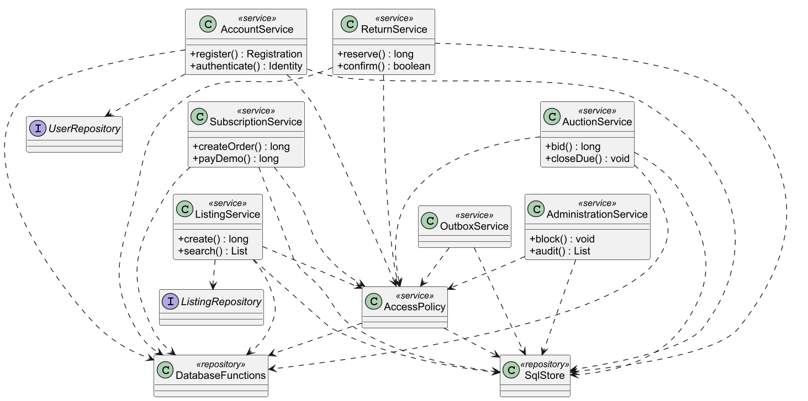

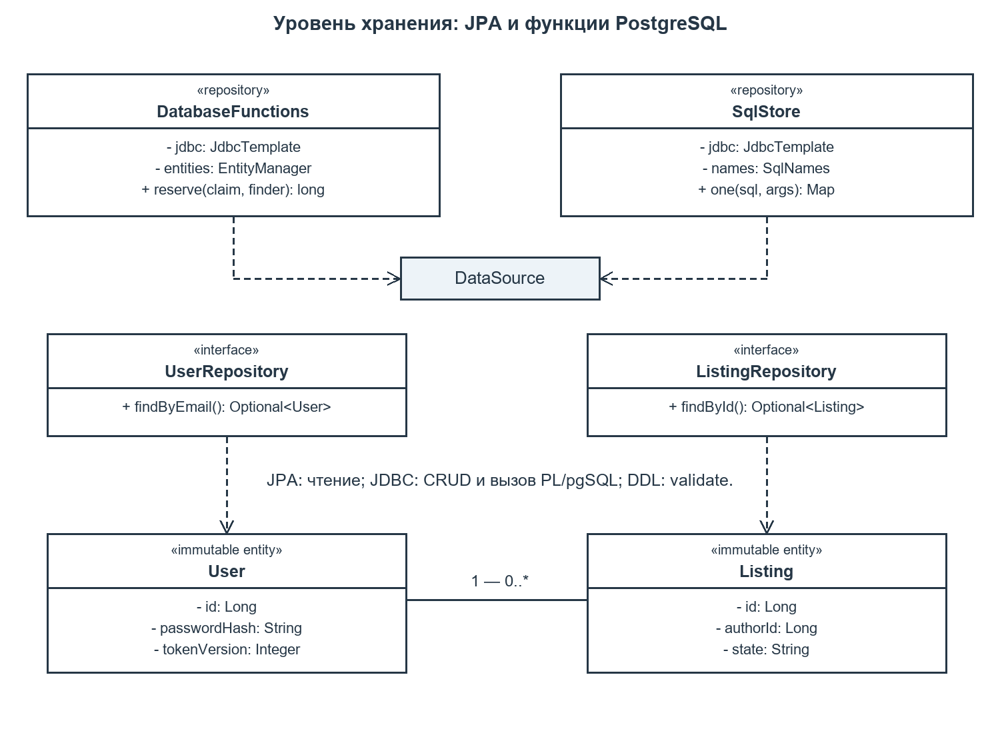

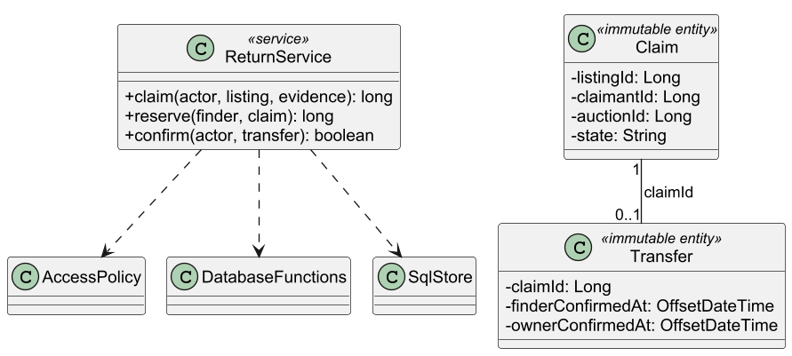

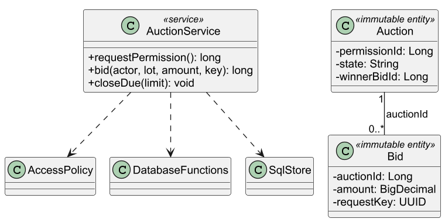

Стрелка зависимости означает использование класса. Пустой треугольник в исходниках PlantUML показывает наследование интерфейса Repository. Связи между сущностями обозначают внешние ключи базы данных, а не автоматическую загрузку графа объектов Hibernate. Например, Claim связан с Transfer как 1:0..1, а Auction с Bid как 1:0..*. Составной ключ UserRole сохраняет отношение M:N пользователей и ролей.

## 17. Уровень хранения

### 17.1. Отображение базы данных

В пакете domain определены 27 JPA-сущностей, соответствующих всем таблицам второго этапа. UserRole использует составной идентификатор UserRoleKey. Для bigint применяется Long, для integer — Integer, для smallint — Short, для денежных значений numeric — BigDecimal. Моменты времени представлены OffsetDateTime; обмен выполняется в UTC. Для jsonb задан JDBC-тип JSON. Вычисляемый поисковый вектор формируется PostgreSQL и не используется как изменяемое поле JPA.

Все сущности отмечены Hibernate-аннотацией Immutable. UserRepository и ListingRepository предоставляют только операции чтения и не имеют save или delete. Запись выполняется явно через SqlStore и DatabaseFunctions. Это отделяет объектные проекции от переходов состояний и исключает сохранение критичных изменений через обычный JPA-репозиторий.

Таблица 18 — Группы JPA-сущностей

| Группа | Классы |
| --- | --- |
| Аккаунты и полномочия | User, Role, UserRole, RefreshToken, Verification, VerificationToken |
| Подписки и платежи | Tariff, PaymentOrder, PaymentEvent, Subscription |
| Справочники и объявления | Organization, Location, Category, Listing, ListingImage, PrivateAttribute |
| Возврат вещи | Claim, Conversation, Message, Transfer, Complaint |
| Аукцион | AuctionPermission, Auction, Bid |
| События и аудит | Notification, OutboxEvent, AuditEntry |

SqlStore использует JdbcTemplate и параметры PreparedStatement. Наименование префикса проверяется по ограниченному шаблону; ввод пользователя не включается в SQL-идентификаторы. На helios применяется префикс lf_, а в проверочном наборе — lf3check_. JPA и JDBC получают одинаковые значения префикса и работают с одним DataSource.

После записи через JDBC контекст EntityManager очищается. Поэтому JPA-чтение в той же транзакции не возвращает устаревшее состояние объекта, изменённого SQL-функцией или триггером. Денежные значения не переводятся в double и проверяются на положительность, размер и число десятичных знаков.

### 17.2. Использование PL/pgSQL второго этапа

Для критичных операций DatabaseFunctions вызывает функции PostgreSQL второго этапа. Продление подписки, резервирование, подтверждение передачи, приём ставки и определение победителя выполняются в базе данных в одной транзакции.

Таблица 19 — Соответствие Java-методов операциям PostgreSQL

| Метод DatabaseFunctions | Операция PostgreSQL | Где используется |
| --- | --- | --- |
| assertUser | lf_assert_user | AccessPolicy: подтверждение, состояние и подписка |
| assertModerator | lf_assert_moderator | AccessPolicy: служебные операции |
| consumeToken | lf_consume_token | AccountService: подтверждение почты и восстановление |
| activateSubscription | lf_activate_subscription | SubscriptionService: учебная оплата |
| reserve | lf_reserve_found | ReturnService: согласование возврата |
| confirm | lf_confirm_transfer | ReturnService: подтверждение передачи |
| resolveReturn | lf_resolve_return | ReturnService: решение модератора |
| bid | lf_place_bid | AuctionService: ставка и повтор запроса |
| finalizeAuction | lf_finalize_auction | AuctionService: завершение конкретного лота |
| closeDue | lf_close_due_auctions | AuctionService: пакетное завершение торгов |
| search | lf_search_listings | ListingService: поиск и фильтрация |
| searchByState | lf_search_listings_state | ListingService: поиск с выбранным публичным статусом |

Вызов резервирования содержит только обращение к функции:

```java
public long reserve(long claim, long finder) {
    return number("select lf_reserve_found(?,?)", claim, finder);
}
```

Ставка также выполняется через функцию:

```java
public long bid(long auction, long bidder,
                BigDecimal amount, UUID key) {
    return number("select lf_place_bid(?,?,?,?)",
                  auction, bidder, amount, key);
}
```

Процедура завершения вызывается командой CALL. Предел пакета проверяет сама процедура. На уровне сервисов реализованы полномочия инициатора и типы входных значений; расчёт победителя и изменения связанных записей остаются внутри PostgreSQL.

### 17.3. Транзакции и целостность

Публичные методы сервисов выполняются с Transactional. JpaTransactionManager объединяет JPA и JDBC в одной транзакции. Вызов функции, изменение обычных записей, события outbox и аудит завершаются совместно. Ошибка ограничения или функции вызывает откат. Deferred-ограничения второго этапа проверяются при завершении транзакции; в положительных интеграционных сценариях дополнительно выполняется SET CONSTRAINTS ALL IMMEDIATE.

Автор действия передаётся командой set_config с третьим параметром true. Значение lf.actor_id существует только внутри текущей транзакции и не переносится другому пользователю через пул соединений. Для фоновой задачи автор отсутствует. Триггеры второго этапа сохраняют изменения в неизменяемом журнале.

Для резервирования и ставок сохраняется порядок блокировок SQL-функций: объявление, затем связанная заявка или аукцион. При оплате сначала блокируется пользователь, после чего проверяются его состояние и заказ. Это исключает взаимную блокировку двух подтверждений оплаты при попытке повысить общую блокировку пользователя до исключительной.

Повтор принятой ставки дополнительно проходит проверку актуальной подписки и состояния пользователя. Поэтому заблокированный участник не получает успешный результат повторного запроса только из-за ранее сохранённого ключа. Ключи заявок на оплату и ставок представлены UUID; повтор с другим содержимым отклоняется.

## 18. Уровень бизнес-логики

### 18.1. Учётные записи и подписка

При регистрации AccountService нормализует адрес, проверяет имя и пароль, сохраняет BCrypt-хеш и роль user. Одновременно создаются заявка на проверку профиля и одноразовый токен подтверждения почты. В базе хранится SHA-256-хеш токена. Исходное значение является внутренним результатом сервиса для почтового адаптера и не публикуется в каталоге или журнале.

После подтверждения почты профиль рассматривает независимый модератор. Одного подтверждения адреса недостаточно для платных операций: требуется состояние verified. После отказа пользователь может повторно подать профиль, если новая заявка ещё не ожидает рассмотрения.

authenticate проверяет BCrypt и возвращает Identity с идентификатором пользователя и версией сессии. checkIdentity повторно проверяет блокировку и token_version. При смене пароля версия увеличивается триггером, а refresh-токены отзываются в той же транзакции. Подписание access JWT, работа Cookie и HTTP-фильтр будут реализованы на транспортном этапе; Identity используется здесь как внутренний результат проверки учётных данных.

SubscriptionService фиксирует параметры выбранного тарифа в платёжном заказе. Повтор createOrder с тем же ключом возвращает прежний заказ только для того же пользователя и тарифа. Учебный payDemo проверяет владельца и берёт сумму из сохранённого заказа. Он не принимает произвольную сумму от пользователя и не является открытым callback внешнего провайдера. Продление выполняет lf_activate_subscription: сохраняет событие оплаты один раз и добавляет срок после уже оплаченного периода.

### 18.2. Объявления и справочник метрополитена

ListingService создаёт объявления только для проверенного подписчика. Время и место представлены идентификаторами справочников и моментами события; проверяются тип объявления, заголовок и описание. На пользователя допускается не более десяти новых объявлений за календарные сутки по времени PostgreSQL. Пользователь отправляет черновик на проверку, а независимый модератор публикует или отклоняет его.

Существенное редактирование возвращает объявление в состояние pending посредством триггера. Нельзя менять тип и автора, редактировать вещь во время незавершённого аукциона или после согласования передачи. Закрытые признаки доступны только автору. Публичная карточка строится по явной проекции lf_public_listings и не содержит email, хешей, доказательств заявителей или закрытых признаков.

attachImage сохраняет метаданные уже проверенного объекта: принадлежность ключа объявлению, JPEG/PNG/WebP, размер до 5 МиБ и позицию от 1 до 5. Установка MinIO, загрузка двоичных данных, проверка содержимого изображения и удаление EXIF относятся к файловому адаптеру последующего этапа. Наличие строки метаданных не означает, что двоичный файл уже загружен.

Поиск выполняется через lf_search_listings с текстом, видом, категорией, местом, временем и курсором. Метод searchByState вызывает lf_search_listings_state для отбора по публичному статусу; черновики и скрытые объявления эта функция не возвращает. Справочник организаций содержит официальный источник, дату проверки и признак устаревания после 30 суток. Для Петербургского метрополитена возвращаются телефон и инструкция, подготовленные на втором этапе. Если вещь хранит организация, ReturnService направляет владельца в эту организацию и не создаёт обычный процесс выдачи пользователем.

### 18.3. Заявки, сообщения и возврат

Заявитель указывает закрытые доказательства владения. Создание заявки и диалога выполняется в одной транзакции. Доступ к сообщениям проверяется как при чтении, так и при записи: участниками являются автор находки и заявитель. Модератор получает доступ при открытой жалобе на эту находку и теряет его после закрытия дела. Ограничение отправки составляет 30 сообщений за минуту. При истёкшей подписке подтверждённый пользователь сохраняет доступ к уже созданному диалогу.

Согласование возврата вызывает lf_reserve_found. Функция проверяет автора находки, незавершённые торги и доступность вещи, принимает одну заявку, резервирует объявление и создаёт передачу. Отмена принятой обычной заявки согласованно снимает резерв, пока ни одна сторона не подтвердила передачу. Конкурирующая заявка не может получить вторую принятую передачу той же вещи.

Для завершения вызывается lf_confirm_transfer отдельно от каждой стороны. Первое подтверждение сохраняется, но не завершает возврат. Второе переводит заявку, вещь и передачу в завершённое состояние. Уже согласованный возврат можно закончить после истечения подписки. Спор разрешается через lf_resolve_return с полномочиями независимого модератора и обязательным обоснованием.

### 18.4. Допуск к аукциону и торги

AuctionService принимает заявку на продажу с основанием и ключом документа. Проверку выполняет модератор. Ограничения второго этапа запрещают продажу документов, банковских карт и вещей организации-хранителя. Для основания six_months требуется истечение шести месяцев с официального сообщения о находке, а не с публикации объявления. Самостоятельного автоматического признания права собственности в приложении нет.

После одобрения допуска продавец задаёт начальную цену, шаг и окно торгов. Ставки передаются только в lf_place_bid. PostgreSQL проверяет статус торгов, серверное время, подписку, продавца, текущий максимум и шаг. Java не формирует альтернативную вставку в lf_bids. Новая заявка владельца приостанавливает аукцион; заблокированный участник также приводит к приостановке связанных торгов.

Завершение отдельного лота вызывает lf_finalize_auction. Фоновое пакетное завершение вызывает lf_close_due_auctions. Приостановленные торги не закрываются автоматически. Без ставок вещь сохраняется в каталоге. Для победителя PL/pgSQL создаёт принятое дело с auction_id, диалог и передачу; вещь переходит через auctioned в reserved. Повтор завершения не создаёт вторую передачу. Продавец и победитель используют обычные два подтверждения; истёкшая подписка этому не препятствует. Односторонняя отмена результата торгов и отмена уже подтверждённой одной стороной передачи запрещены; спор разбирает модератор. Оплата купленного лота не входит в предметную область курсовой.

### 18.5. Жалобы, администрирование и события

AdministrationService принимает жалобы, проверяет независимость модератора, блокирует пользователей и управляет служебными данными. Обычный модератор не может блокировать сотрудника без роли admin. Блокировка и изменение роли требуют причины. Администратор назначает и отзывает роли, создаёт и отключает тарифы, обновляет справочник организаций. Отзыв роли последнего действующего администратора запрещён; проверка выполняется под блокировкой записи роли и повторной проверкой полномочий инициатора. Аудит доступен только служебным ролям с ограниченным размером страницы. Для проверки профилей, жалоб, изменения ролей, тарифов и справочников сервисы дополняют триггерный аудит явными записями в той же транзакции.

OutboxService выбирает недоставленные события с FOR UPDATE SKIP LOCKED. Уведомления и delivered_at сохраняются в одной транзакции. Сообщение уведомляет другую сторону без копирования частного текста. Окончание последнего периода подписки создаёт одно устойчивое событие; активное продление исключает ложное уведомление. Решение по профилю и жалобе видно получателю в кабинете, в том числе до одобрения профиля. Событие активации подписки помечается доставленным без повторной вставки: исходное уведомление уже создаёт функция оплаты. SMTP-доставка с собственным повтором и внешняя рассылка ещё не подключены.

Таблица 20 — Соответствие прецедентов первого этапа реализации

| Прецедент | Реализованные методы | Граница третьего этапа |
| --- | --- | --- |
| UC-01 Регистрация | register, confirmEmail | Доставка письма подключается отдельно |
| UC-02 Проверка профиля | submitProfile, reviewProfile | Решение сохраняется через триггеры |
| UC-03 Вход и восстановление | authenticate, checkIdentity, requestPasswordReset, resetPassword | HTTP, JWT и Cookie — следующий этап |
| UC-04 Подписка | createOrder, payDemo, periods | Учебная оплата без настоящего списания |
| UC-05 Объявление | create, edit, submit, archive, attachImage, putPrivateAttribute | Двоичное хранилище фотографий подключается отдельно |
| UC-06 Модерация | moderate | Нет самомодерации |
| UC-07 Поиск | search, detail | Используется lf_search_listings |
| UC-08 Метрополитен | organizations, detail | Справочник официальных контактов |
| UC-09 Заявка и резерв | claim, send, messages, reserve, reject, cancel | Приватность и единственный резерв |
| UC-10 Передача | confirm, resolve | Два подтверждения или решение модератора |
| UC-11 Жалобы | complain, reviewComplaint, block | Жалоба на один объект |
| UC-12 Допуск и лот | requestPermission, reviewPermission, create | Правовое основание проверяет модератор |
| UC-13 Ставки | bid | PL/pgSQL и ключ повторного запроса |
| UC-14 Завершение | finalizeAuction, closeDue, cancel | Выбор победителя в PostgreSQL |
| UC-15 Администрирование | grantRole, revokeRole, tariff, retireTariff, updateOrganization | Только служебные роли, причина и защита последнего администратора |
| UC-16 Аудит | audit | Неизменяемый журнал второго этапа |

## 19. Проверка и демонстрация на helios

### 19.1. Изолированные интеграционные проверки

Проверки выполняются с настоящим PostgreSQL на helios. Java-команда verify модуля tooling создаёт временный набор lf3check_* из SQL второго этапа в схеме s465826, заполняет его синтетическими данными и запускает Gradle test. Java подключается через локальный SSH-туннель; пароль базы передаётся в окружение дочернего процесса и не сохраняется в исходных файлах. Отдельная команда verify-db проверяет целостность и конкуренцию на наборе lfcheck_*.

Имена таблиц, функций, триггеров, индексов и последовательностей меняются согласованно. Проверочный набор не использует lf_* и объекты другой лабораторной. Перед запуском проверяется отсутствие lf3check_*. Если они уже существуют, скрипт останавливается и не удаляет их автоматически. После выполнения используются штатный безопасный drop.sql, проверка каталога объектов и сравнение значений исходных последовательностей.

ServiceIntegrationTest выполняется с откатом каждого сценария. TransactionIntegrationTest проверяет реальные коммиты, параллельные соединения и завершение аукциона по серверному времени. Все коммиты происходят внутри одноразового набора, который затем удаляется целиком. SqlNamesTest проверяет допустимые идентификаторы. Встроенная H2 и мок-реализация SQL-функций не используются.

Таблица 21 — Группы проверок третьего этапа

| Группа | Что проверяется |
| --- | --- |
| Аккаунты | BCrypt, регистрация, одноразовый токен, модерация, восстановление и отзыв сессии |
| Подписки | Повтор заказа и события, продление, чужой заказ, откат ошибочной оплаты |
| Объявления | Публикация, новая модерация после правки, время, собственник, метаданные изображений |
| Приватность | Явная публичная карточка, закрытые признаки и доступ к диалогу |
| Возврат | Один резерв, отмена, два подтверждения, истечение подписки, решение модератора |
| Торги | Повтор ставки, смена содержимого ключа, продавец, заблокированный участник, приостановка, победитель |
| Администрирование | Полномочия, жалобы, тарифы, роли, уведомления и аудит |
| События | Доставка outbox и отсутствие дубликатов при повторе |
| Конкуренция | Два резервирования одной вещи и два подтверждения одного платежа |
| Изоляция | Сохранность исходных объектов, последовательностей и удаление проверочного набора |

Актуальный общий прогон содержит 113 тестов, без ошибок и пропусков. Из них 57 проверяют хранение, предметные сервисы и идентификаторы SQL, а 56 — веб-уровень и файловый адаптер четвёртого этапа. Компиляция и bootJar завершены успешно. Подробные протоколы находятся в docs/part3/validation/integration.txt и isolation.txt; краткий результат по тестовым классам — в tests.json. Протокол запуска собранного приложения на helios сохранён в helios.txt, контрольная сумма установленного JAR — в deployment.txt.

Дополнительно повторно выполнена проверка базы второго этапа: 50 условий целостности, конкурирующие резервы и ставки, повтор оплаты, пакетное завершение и удаление только проверочного набора. Результат сохранён в database-regression.txt. Основные объекты курсовой и лабораторной сохранены.

### 19.2. Сборка и запуск

Локальная сборка требует JDK 17 и доступа к Maven Central. Gradle устанавливается через Wrapper; контрольная сумма дистрибутива задана в gradle-wrapper.properties.

```powershell
cd D:\IS\course\backend
$env:JAVA_HOME='C:\Users\minec\.jdks\corretto-17.0.14'
.\gradlew.bat test bootJar
```

Без RUN_DB_TESTS интеграционные проверки пропускаются. Для полного прогона используется следующая Java-команда; SSH-пароль запрашивается скрытым вводом:

```powershell
cd D:\IS\course
& "$env:JAVA_HOME\bin\java.exe" -Xmx256m `
  -jar tooling/build/libs/course-tools.jar verify
```

На helios JAR расположен только в каталоге курсовой. Launcher использует DB_URL, DB_USER и DB_PASSWORD, а при отсутствии пароля читает подходящую запись .pgpass. Глобальные настройки пользователя и файлы другой лабораторной не меняются.

```sh
cd ~/poteryashki-course
java -Xmx256m -jar tooling/build/libs/course-tools.jar launch --demo
```

Для JVM заданы -Xms64m и -Xmx256m, поскольку автоматический выбор максимальной памяти на helios превышает доступный объём. Приложение запускается на установленном OpenJDK 21, а байткод собран для Java 17. Демонстрация читает синтетический аккаунт нашедшего, выполняет поиск функцией PL/pgSQL, показывает контакты метрополитена и число уведомлений.

На старте Hibernate проверяет соответствие 27 сущностей существующей схеме в режиме ddl-auto=validate. Приложение не создаёт и не удаляет таблицы, не использует общий flyway_schema_history лабораторной и не запускает миграции другой работы. Скрипты DDL второго этапа остаются источником структуры базы.

### 19.3. Границы реализации

Третий этап завершает хранение и бизнес-логику. Веб-страницы, контроллеры Spring MVC, выпуск JWT, защищённые Cookie, HTTP-ограничение попыток входа, SMTP и двоичный MinIO-адаптер относятся к последующему этапу. Доступ к Java-сервисам предполагается из доверенного транспортного слоя: он должен получать пользователя из проверенной сессии, а не из произвольного параметра запроса. Отдельного публичного endpoint с передачей actorId нет.

Проверки третьего этапа охватывают доступ к базе, переходы состояний, транзакции, права участников и доставку внутренних уведомлений. Измерение производительности интерфейса и испытания резервного копирования, HTTPS и внешних интеграций в этот этап не входят.

## 20. Результаты третьего этапа

Разработаны диаграммы классов, 27 отображений таблиц, репозитории и семь предметных сервисов с общим контролем доступа. Критичные процессы используют функции и процедуру PL/pgSQL второго этапа. Работа Java-кода проверена на настоящем PostgreSQL, включая конкуренцию и откат ошибок. Собранный JAR запускается на helios в отдельном каталоге курсовой.

## Источники третьего этапа

1. Пример структуры Java-проекта и отчёта: [MyFilmList, фиксированный коммит](https://github.com/maxbarsukov/MyFilmList/tree/74d1928973cae329d6ca651bac2ffde445a43de0).
2. [Spring Boot 3.5: требования к среде](https://docs.spring.io/spring-boot/3.5/system-requirements.html).
3. [Spring Framework: JdbcTemplate и обработка SQL](https://docs.spring.io/spring-framework/reference/data-access/jdbc/core.html).
4. [Spring Framework: совместная работа JPA и JDBC](https://docs.spring.io/spring-framework/docs/current/javadoc-api/org/springframework/orm/jpa/JpaTransactionManager.html).
5. [PostgreSQL: блокировки и конкуренция](https://www.postgresql.org/docs/current/explicit-locking.html).

## Задание четвёртого этапа

1. Реализовать уровень представления для бизнес-процессов первого этапа.
2. Сформировать итоговый отчёт, включающий предыдущие этапы.
3. Подготовить и представить проект.

## 21. Уровень представления

### 21.1. Технологии и структура

Веб-интерфейс реализован на Java 17, Spring MVC и Thymeleaf. Браузер получает готовые HTML-страницы; формы отправляют запросы на контроллеры приложения. Для оформления используется локальный файл CSS. Отдельная сборка frontend и прикладной JavaScript не требуются. Серверный вариант интерфейса сохраняет выбранный на предыдущих этапах стек Spring Boot, Hibernate/JPA, PostgreSQL, Lombok и Gradle.

Контроллеры сгруппированы по процессам: AccountPages обслуживает доступ к аккаунту; MainPages — личный кабинет, подписку, уведомления и справочник; ListingPages — каталог и объявления; ReturnPages — заявки и диалоги; AuctionPages — допуски, лоты и ставки; StaffPages — служебные операции. MediaPages выдаёт вложения после проверки полномочий. WebQueries формирует проекции для шаблонов без паролей, хешей токенов и закрытых примет чужих вещей.

Контроллер передаёт идентификатор участника из проверенного WebIdentity. Идентификатор действующего пользователя не принимается из формы. Предметные операции выполняют существующие сервисы третьего этапа. Поиск, резервирование, подтверждение передачи, активация подписки, ставка и завершение торгов продолжают использовать функции и процедуры PostgreSQL второго этапа.

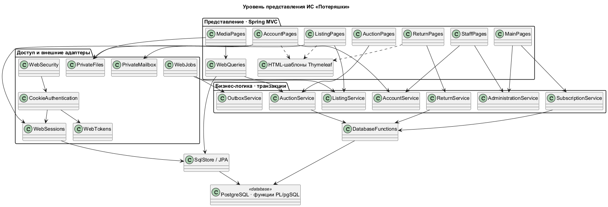

### 21.2. Страницы и прецеденты

Таблица 24 — Соответствие интерфейса прецедентам

| Прецедент | Страница и действие |
| --- | --- |
| UC-01. Зарегистрироваться | /auth/register; подтверждение по одноразовой ссылке /auth/confirm |
| UC-02. Проверить профиль | Личный кабинет показывает статус; /staff, очередь профилей |
| UC-03. Войти и восстановить доступ | /auth/login, /auth/forgot, /auth/reset; обновление и выход из сеанса |
| UC-04. Оформить подписку | /subscriptions; создание заказа и учебная оплата |
| UC-05. Разместить объявление | /listings/new; сохранение, закрытые приметы, загрузка фото, отправка на проверку |
| UC-06. Проверить объявление | /staff?tab=listings; просмотр материалов и публикация либо отказ |
| UC-07. Найти вещь | /catalog; текст, тип, категория, место, время и публичный статус; до 20 карточек на страницу; карточка /listings/{id} |
| UC-08. Получить инструкцию метро | /metro и карточка вещи на хранении; контакты, порядок обращения, источник |
| UC-09. Подать и рассмотреть заявку | Карточка находки, /claims, /conversations/{id}; доказательства, сообщения, резерв |
| UC-10. Подтвердить передачу | /claims; отдельное подтверждение каждой стороны |
| UC-11. Подать и разобрать жалобу | Формы в карточке и диалоге; собственные решения в кабинете; очередь жалоб и доступ сотрудника к диалогу только при открытом деле |
| UC-12. Получить допуск и создать лот | /auctions; закрытый документ, решение модератора, параметры торгов |
| UC-13. Сделать ставку | /auctions/{id}; сумма и ключ повторного запроса |
| UC-14. Завершить аукцион | Планировщик WebJobs; переход победителя и продавца к заявкам |
| UC-15. Управлять справочником и доступом | /admin; роли, тарифы и контакты организаций |
| UC-16. Просмотреть аудит | /staff?tab=audit; неизменяемая история и переход к ранним записям |

Регистрация и личный кабинет доступны до подписки. Для каталога, публикации и участия в торгах нужны подтверждённая почта, проверенный профиль и действующая подписка. Чтение собственного диалога и завершение согласованной передачи сохраняются после окончания оплаченного периода. Служебные операции требуют роли модератора или администратора.

### 21.3. Организация интерфейса

Главная страница объясняет порядок возврата вещи и открывает поиск либо создание объявления. Основная навигация содержит каталог, инструкцию метро и личный кабинет. Для авторизованного пользователя боковое меню показывает объявления, заявки, подписку и письма. Служебные пункты появляются при соответствующей роли.

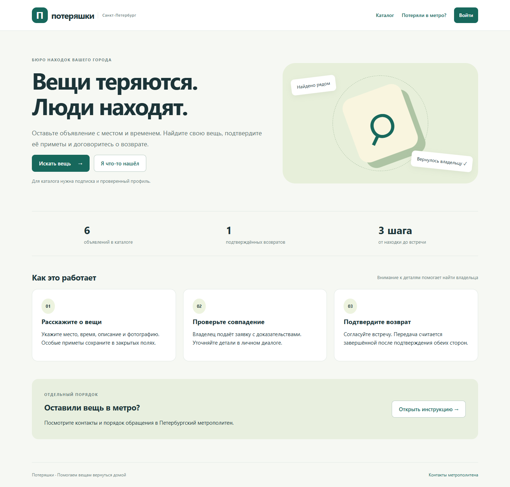

В каталоге фильтры передаются параметрами GET, поэтому результат можно открыть по сохранённой ссылке. Следующая страница использует идентификатор последней записи как курсор и сохраняет фильтры. При отсутствии совпадений выводится пояснение с предложением изменить условия.

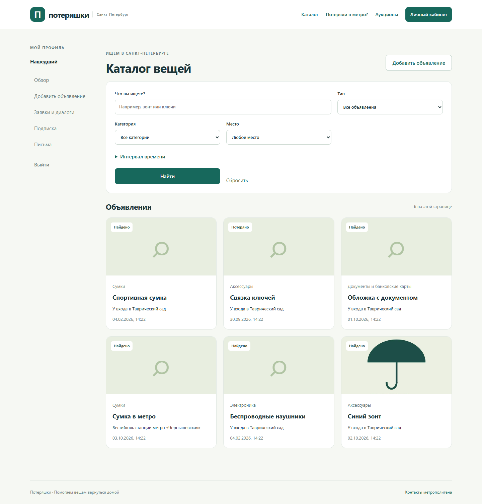

Редактор разделяет публичное описание и закрытые признаки. После сохранения автор может загрузить фотографии и отправить черновик на модерацию. Изменение опубликованного объявления требует повторной проверки согласно правилам предыдущего этапа. Дата и время вводятся по часовому поясу Europe/Moscow.

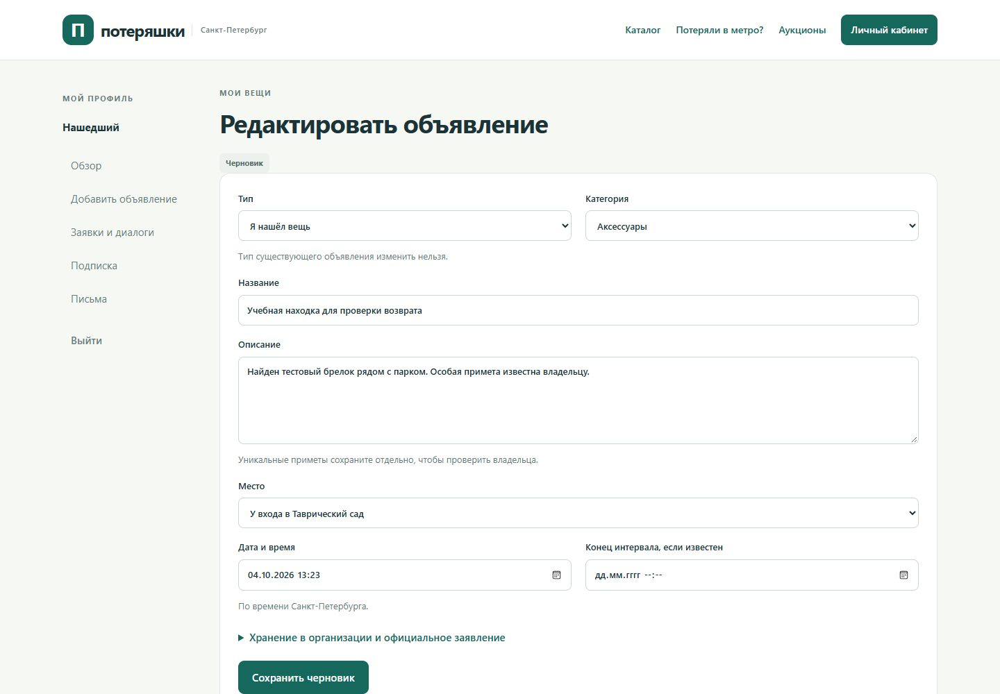

Модератор рассматривает отдельные очереди. Для проверки профиля, допуска к продаже и разрешения спора вводится мотивированное решение. Проверка не позволяет сотруднику одобрить собственное объявление. Изменение ролей и тарифов доступно администратору.

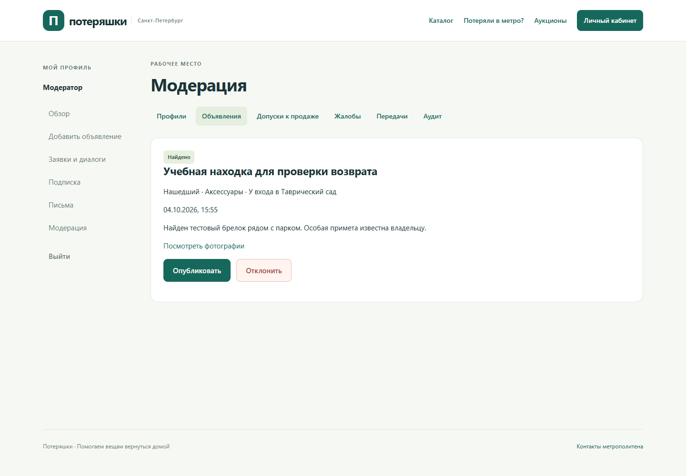

Диалог доступен участникам заявки. Доказательства владения не выводятся в публичной карточке. После резервирования карточка заявки показывает два независимых подтверждения. Одно нажатие не завершает передачу; окончательное состояние устанавливает функция базы данных.

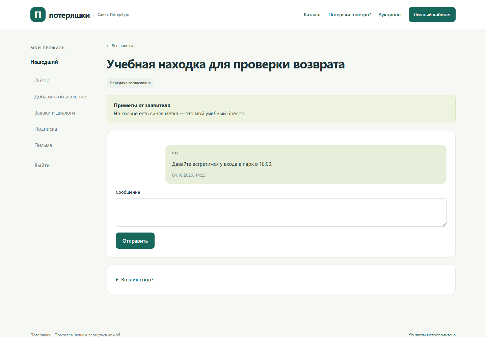

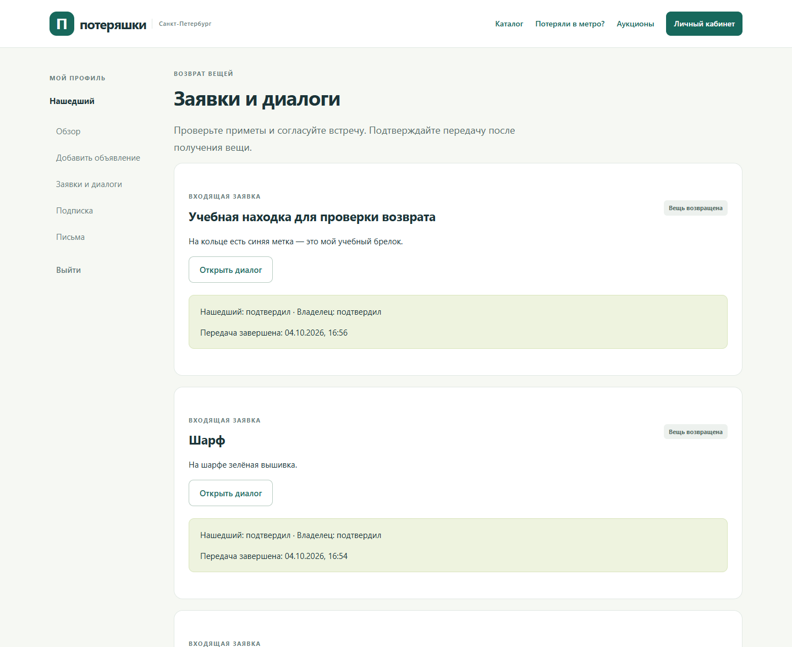

Карточка аукциона показывает начальную цену, текущую ставку, шаг, начало и окончание торгов. Форма не показывается продавцу. Сервер повторно проверяет ограничения при отправке запроса; сохранённая или изменённая вручную форма не обходит проверки PostgreSQL.

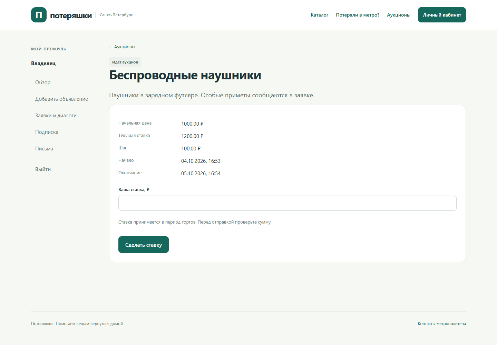

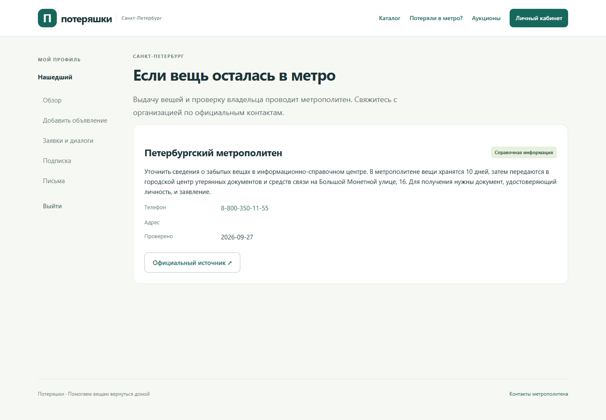

Администратор видит пользователей и роли, управляет новыми тарифами и обновляет официальные контакты. Закрытие тарифа не меняет условия уже созданных заказов. При отзыве роли проверка доступа учитывает актуальные данные базы.

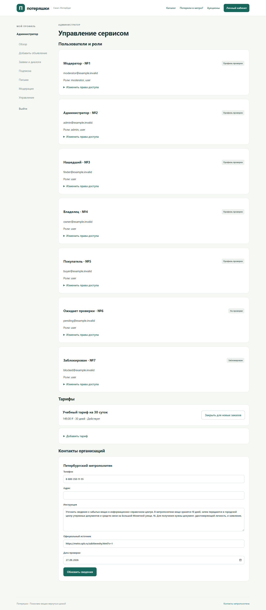

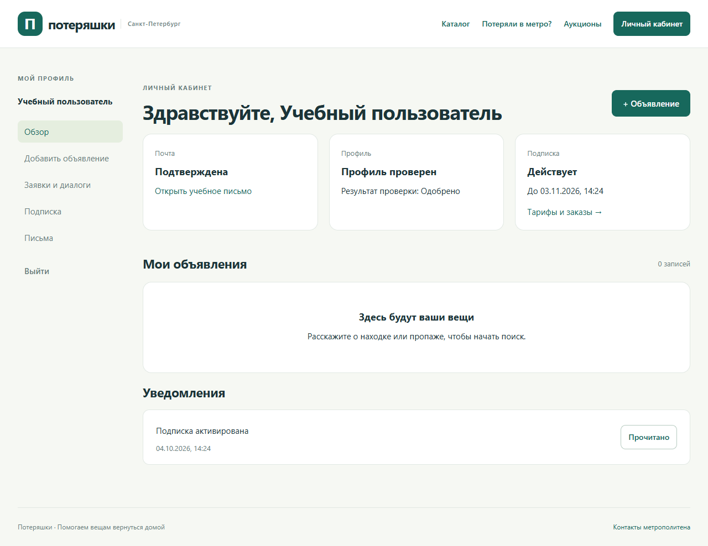

При ширине 390 пикселей карточки и формы выстраиваются в одну колонку, меню переносится на несколько строк. Поля имеют подписи и видимый фокус; минимальная высота полей ввода и основных кнопок — 44 пикселя. Проверка на этой ширине не заменяет проверку всех устройств и средств доступности.

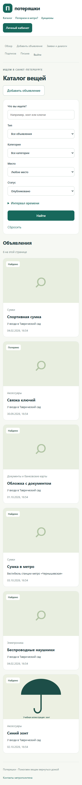

## 22. Доступ и обработка данных

### 22.1. Сеансы и защита форм

WebSessions проверяет пароль BCrypt и создаёт случайный refresh-токен. В PostgreSQL сохраняется только его SHA-256. Access JWT действует 15 минут; refresh-токен — 30 суток. Оба передаются в HttpOnly cookie с SameSite=Lax. На каждом запросе проверяются версия токена пользователя, блокировка, срок и отзыв сеанса, текущие роли. Обновление атомарно отзывает прежний refresh-токен. Выход и смена пароля прекращают действие ранее выпущенных сеансов.

Spring Security проверяет CSRF-токен изменяющих запросов. Thymeleaf добавляет его к формам POST. Политика CSP запрещает скрипты, внешние стили и встраивание приложения во фрейм. Referrer-Policy не передаёт адрес страницы с одноразовым токеном сторонним сайтам. В публичном размещении требуются HTTPS и COOKIE_SECURE=true; учебный запуск выполняется на loopback через SSH-туннель. Секрет JWT можно задать переменной JWT_SECRET; при отсутствии создаётся случайный ключ на время запуска.

Пять неудачных попыток входа на один адрес в 15-минутном окне блокируют дальнейшие попытки до окончания окна. Счётчик находится в памяти одного процесса, поэтому перезапуск его сбрасывает; распределённая защита входа в этой версии не реализована.

### 22.2. Почта и вложения

MAIL_MODE=demo сохраняет учебные письма в памяти и показывает их только авторизованному получателю. При регистрации новый пользователь входит в собственный кабинет и открывает подтверждение. Публичный запрос восстановления всегда возвращает одинаковый результат и не раскрывает одноразовый токен. Полноценное восстановление забытого пароля без действующего входа требует MAIL_MODE=smtp и настроенного SMTP-сервера; учебный ящик для этого не заменяет внешнюю почту.

SMTP-адаптер использует STARTTLS и получает реквизиты из окружения; подключение к внешнему почтовому серверу не проверялось. Учебные письма исчезают после перезапуска. Платёжный адаптер работает без списания средств, что указано на кнопке оплаты. Сумма берётся из сохранённого заказа.

PrivateFiles хранит файлы вне каталога статических ресурсов. При загрузке фотографий проверяются сигнатура JPEG/PNG, размер до 5 МБ и разрешение до 16 миллионов пикселей. Изображение декодируется и сохраняется заново без исходных метаданных. Имя формируется из UUID; путь проверяется на выход из корневой папки и символические ссылки. При отказе базы новый файл удаляется.

Подтверждение допуска принимает PDF либо изображение. PDF проверяется по сигнатуре и выдаётся как скачиваемое вложение, а не встроенная страница. Антивирусная проверка и полная проверка структуры PDF не реализованы. Документ доступен заявителю и модератору. Частные ответы не кешируются. В тестовом наборе старые ключи demo/ соответствуют явно помеченным учебным вложениям из закрытых ресурсов приложения; они не являются юридическими документами.

Файлы хранятся в закрытом локальном каталоге. MinIO не подключён; механизм восстановления файлов и автоматическая уборка объектов после аварийного завершения процесса не реализованы.

### 22.3. Фоновые операции

WebJobs каждые 30 секунд вызывает существующую процедуру закрытия истёкших аукционов и доставляет события Outbox во внутренние уведомления. Действия выполняются через предметные сервисы. Ошибка оставляет событие для следующего прохода. Планировщик отключается в интеграционных проверках, чтобы тестовые сценарии не изменялись параллельно.

Завершение торгов создаёт в PL/pgSQL одну заявку победителя, диалог и передачу. Победитель и продавец видят дело в /claims и отдельно подтверждают фактическую передачу. Отмена после первого подтверждения и односторонняя отмена результата аукциона запрещены. Жалоба из диалога относится к находке и доступна участнику при истёкшей подписке; модератор теряет доступ к чужому диалогу после закрытия дела. Получатель сообщения, автор проверенного профиля и автор рассмотренной жалобы получают внутренние уведомления. Истёкший последний период подписки уведомляет один раз, без ложного события при активном продлении.

## 23. Проверка веб-приложения

### 23.1. Условия проверки

JUnit и MockMvc проверяют реальные сервисы и PostgreSQL через SSH-туннель. Создаются временные таблицы lf3check_; уже существующий набор с этим префиксом не принимается. После проверки набор удаляется, сравниваются исходные объекты схемы и значения остальных последовательностей. Пароли подключения не записываются в отчёт и репозиторий.

Браузерная проверка выполняется Playwright for Java в установленном Microsoft Edge. Запускается отдельный процесс приложения на свободном loopback-порту. Профили участников изолированы разными контекстами браузера. Используются тестовые адреса example.invalid и учебная оплата. Снимки в этом отчёте получены из работающего приложения.

Таблица 25 — Проверяемые группы сценариев

| Группа | Проверка |
| --- | --- |
| Страницы | Главная, формы доступа, кабинет, каталог, редактор, заявки, аукционы и служебные очереди |
| Полномочия | Анонимный доступ, неоплаченный профиль, чужой редактор и диалог, служебные URL |
| Сеансы | HttpOnly/SameSite, отзыв при выходе и смене пароля, ротация refresh, актуальные роли |
| Формы | Отказ без CSRF, экранирование HTML, отсутствие секретов в публичных проекциях |
| Бизнес-процессы | Ставка через MVC и функцию БД; передача победителю; подтверждение при истёкшей подписке; запрет отмены после подтверждения |
| Жалобы и уведомления | Собственное решение в кабинете; доступ сотрудника только при открытой жалобе; уведомления без раскрытия текста диалога; окончание подписки без повторов |
| Файлы | Реальный PNG, повреждённые PNG/JPEG, подмена MIME/имени, SVG, размер и выход из каталога |
| Браузер | Создание и фото, публикация, заявка, диалог, два подтверждения, жалоба и её рассмотрение, ставка, регистрация и подписка |
| Узкий экран | Каталог при ширине 390 пикселей и отсутствие горизонтального переполнения |

Пройдены 113 тестов приложения и 8 тестов Java-инструментов. Протоколы находятся в docs/part4/validation и docs/part3/validation; результаты по классам тестов приведены в tests.json, журналы прогонов — в integration.txt и browser.txt. Нагрузочные испытания, проверка RPO/RTO и испытания внешних почтового и платёжного сервисов не проводились.

## 24. Демонстрация и итоговые материалы

Приложение размещается в собственном каталоге poteryashki-course на helios, подключается к таблицам lf_ схемы s465826 базы studs. JVM ограничена 64–256 МиБ. Веб-сервер слушает только 127.0.0.1:18081. Для доступа с рабочей машины используется SSH-туннель. Другая лабораторная не включается в состав установки.

Итоговый отчёт этапов 1–4 находится в docs/part1-4/report.md и report.pdf. К защите подготовлены презентация в PDF и HTML и сценарий демонстрации в presentation/defense.md.

Реализованы страницы для всех групп прецедентов первого этапа. Уровень представления использует существующие транзакции и функции БД. Система позволяет пройти путь от регистрации и проверки профиля до публикации, возврата вещи либо продажи с проверенным основанием. Учебные адаптеры и непроверенные эксплуатационные требования указаны отдельно.

В текущей версии отсутствуют автоматическое резервное копирование и восстановление, обезличивание профиля и единый идентификатор HTTP-запроса. Интерфейс проверен в Edge на компьютере и при ширине 390 px; испытания в Chrome и Firefox не проводились. Подключение MinIO и платёжного провайдера остаётся задачей дальнейшей разработки.

## Источники четвёртого этапа

1. Spring Security. CSRF: https://docs.spring.io/spring-security/reference/servlet/exploits/csrf.html.
2. Spring Security. JWT: https://docs.spring.io/spring-security/reference/servlet/oauth2/resource-server/jwt.html.
3. Thymeleaf. Spring integration: https://www.thymeleaf.org/doc/tutorials/3.1/thymeleafspring.html.
4. Playwright for Java. Установка и работа с браузером: https://playwright.dev/java/docs/intro; https://playwright.dev/java/docs/browsers.
