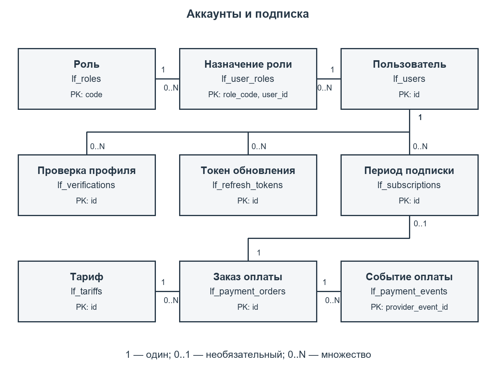
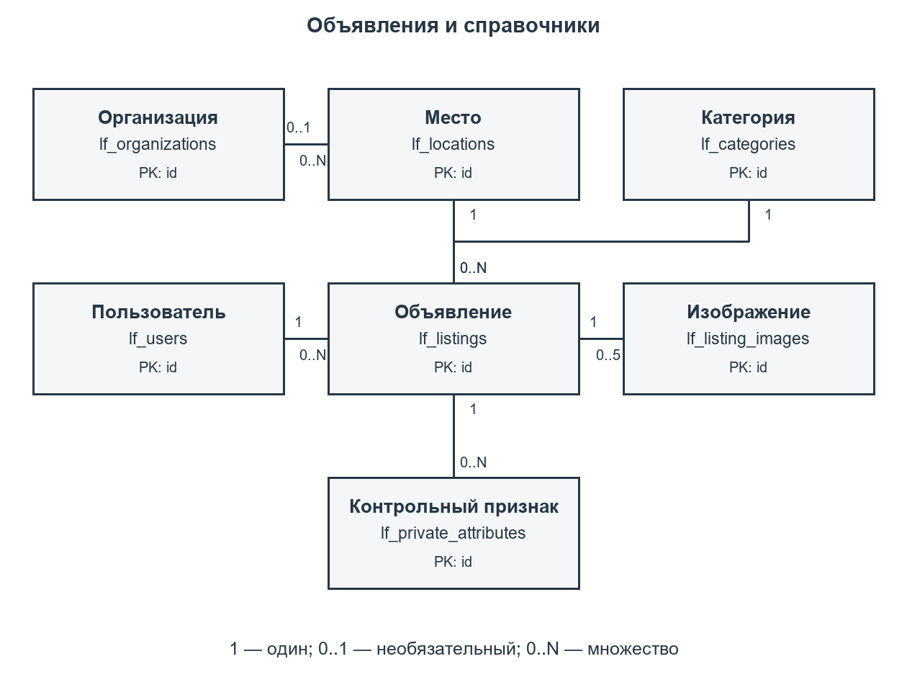
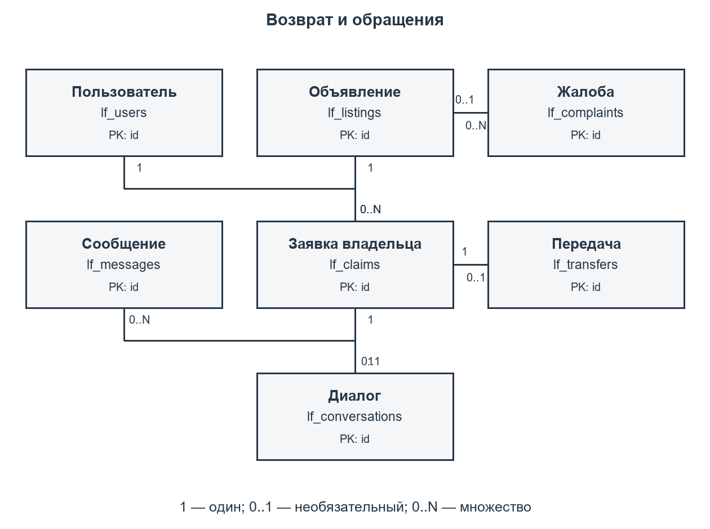
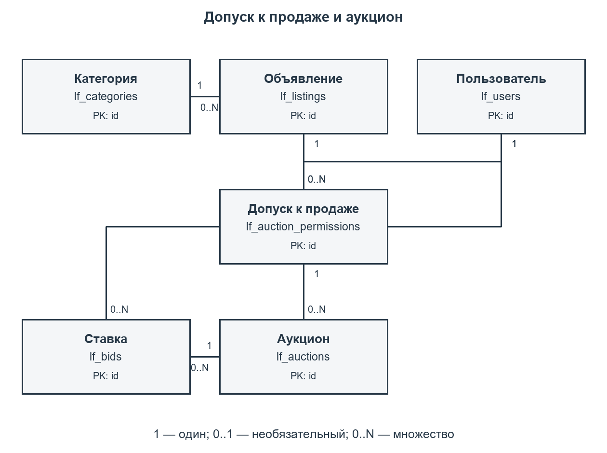
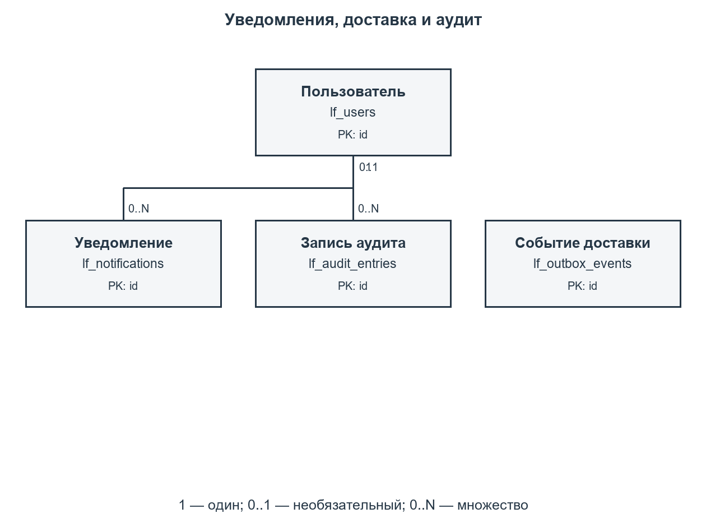
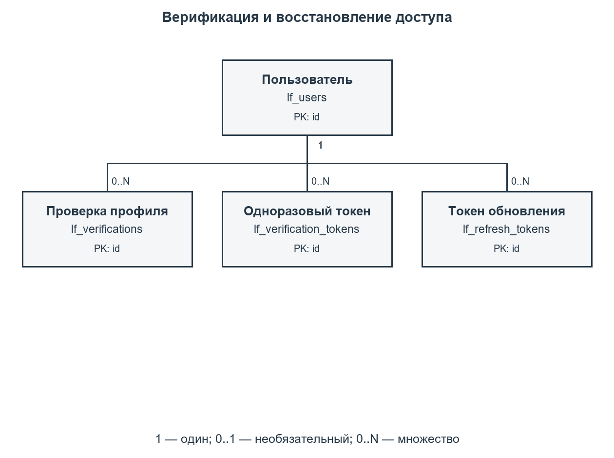

# Информационная система «Потеряшки». Этап 2

## 7. ER-модель базы данных

### 7.1. Сущности и связи

Модель построена на процессах и прецедентах первого этапа. В неё входят 27 сущностей и отношений: пользователи, роли, назначения ролей, проверки профилей, одноразовые токены, токены обновления, тарифы, заказы оплаты, платёжные события, периоды подписки, организации, места, категории, объявления, изображения, контрольные признаки, заявки владельцев, диалоги, сообщения, передачи, жалобы, допуски к продаже, аукционы, ставки, уведомления, события доставки и записи аудита. Таким образом, выполнено требование о наличии не менее десяти сущностей.

Пользователь может иметь несколько ролей, а одна роль назначается нескольким пользователям. Отношение «многие ко многим» реализовано ассоциативной сущностью «Назначение роли»: lf_user_roles(user_id, role_code). Составной первичный ключ исключает повторное назначение одной роли пользователю.

Объявление принадлежит одному автору, одной категории и одному месту. Место может быть связано с организацией, предоставляющей справочную информацию. Организация-хранитель находки задаётся отдельно: событие могло произойти в одном месте, а вещь передана другой организации. Поле custodian_org_id не означает партнёрство организации с приложением.

Заявка связывает находку с претендентом. У находки может быть несколько заявок, но один действующий резерв. Диалог и передача относятся к конкретной заявке и не требуют хранения отдельного списка участников: участники определяются через автора объявления и заявителя. Допуск к продаже относится к находке и продавцу; каждый аукцион использует конкретный допуск. Это исключает подстановку разрешения для другой вещи.

Заказ оплаты фиксирует стоимость и длительность тарифа на момент создания. Изменение справочника тарифов не меняет уже созданный заказ. Внешние события оплаты отделены от периодов подписки, поскольку платёжный сервис может повторить событие. Одному оплаченному заказу соответствует не более одного периода.

Уведомление адресовано пользователю. Событие доставки содержит тип агрегата, его идентификатор и JSON-параметры; эта техническая очередь не имеет универсального внешнего ключа на разные таблицы. Аудит хранит таблицу и идентификатор изменённой сущности. Его actor_id может быть NULL для фоновой операции.

### 7.2. Диаграммы

Модель разделена на шесть листов для чтения в формате A4. Листы показывают основные связи и их мощности; повтор сущности на разных листах не означает дополнительную таблицу. Полный перечень внешних ключей и атрибутов приведён в даталогической модели и словаре отношений. Обозначения: 1 — ровно один, 0..1 — необязательный экземпляр, 0..N — множество.













Редактируемая концептуальная модель находится в docs/part2/model/er.mmd, полная даталогическая схема — в logical.mmd. Формат Mermaid поддерживает отображение ER-диаграмм и связей с ключами. Изображения каждого листа предоставлены в PNG и SVG.

## 8. Даталогическая модель

### 8.1. Преобразование ER-модели

Каждая сущность преобразована в таблицу PostgreSQL. Основные идентификаторы — bigint GENERATED BY DEFAULT AS IDENTITY; код роли является естественным ключом. Для ассоциации пользователей и ролей выбран составной ключ. Связи 1:N реализованы внешними ключами; для связей 1:0..1 добавлено UNIQUE: заявка — диалог, заявка — передача и заказ оплаты — период подписки.

Модель приведена к третьей нормальной форме. Атрибуты пользователя не копируются в объявления, диалоги и ставки. Сведения о категории, месте, организации и тарифе вынесены в справочники. Составной ключ назначения роли не содержит атрибутов, зависящих только от одной его части. Снимок суммы и длительности в заказе относится к самому заказу и необходим для сохранения условий оплаты, поэтому не заменяется ссылкой на текущие значения тарифа.

Время хранится в timestamptz. Начало события обязательно; event_until задаётся только для интервала потери. Денежные значения используют numeric(12,2), без float. Закрытые признаки хранятся в lf_private_attributes и отсутствуют в публичном представлении. Файлы представлены ключами объектов MinIO; бинарные данные не записываются в PostgreSQL. Технические JSON-поля применяются только в очереди событий и аудите, а связи предметной области остаются реляционными.

Циклическая связь аукциона и выигравшей ставки реализована составным внешним ключом (id, winner_bid_id) → lf_bids(auction_id, id), отложенным до завершения транзакции. Победитель не может относиться к другому аукциону. Отложенная проверка резерва позволяет в одной транзакции согласовать заявку и изменить статус объявления. Физический столбец search_vector является контролируемой избыточностью для поиска: PostgreSQL вычисляет его из текста объявления автоматически; в концептуальной нормализованной модели этот атрибут не требуется.

Словарь отношений сформирован из системного каталога PostgreSQL после установки на helios. Он отражает реально созданные типы, возможность NULL, первичные и внешние ключи. Отдельные частичные уникальные индексы описаны в разделе 13.

<!-- DICTIONARY -->

## 9. Реализация в PostgreSQL

### 9.1. Окружение и размещение

Работа установлена 03.10.2026 на helios.cs.ifmo.ru, SSH-порт 2222, учётная запись s465826. Сервер работает под FreeBSD 14.5-STABLE. Доступны PostgreSQL 18.3 и OpenJDK 21.0.4. Java понадобится для следующего этапа; на данном этапе выполняются SQL-скрипты и проверки модели данных.

Подключение к PostgreSQL: хост pg, база studs, схема s465826. У аккаунта есть CREATE в своей схеме, но нет CREATE для базы studs. Поэтому новая база или схема на helios не создаётся. Все таблицы, функции, индексы, триггеры и представление курсовой имеют префикс lf_. Данные другой лабораторной остаются в её существующих объектах.

Каталог на сервере — /home/studs/s465826/poteryashki-course. При создании схемы скрипт использует отдельную транзакцию и ON_ERROR_STOP; повторный запуск на уже созданных объектах останавливается. Удаление проверяет маркер курсовой у таблицы lf_users и перечисляет объекты явно, без DROP SCHEMA и без CASCADE. Внешняя зависимость вызовет ошибку и откат удаления.

### 9.2. Средства DDL

Первичные ключи обеспечивают идентификацию строк. Внешние ключи исключают ссылки на несуществующих пользователей, объявления и заявки. Большинство связей используют RESTRICT/NO ACTION; физическое удаление сущности с историей запрещено. Для изображений и контрольных признаков допускается каскадное удаление вместе с черновиком объявления, если на объявление нет препятствующих внешних ссылок.

CHECK ограничивает допустимые статусы, положительные цены и шаг ставок, интервал подписки и аукциона, размер изображения до 5 МиБ, позицию фотографии от 1 до 5, координаты и совместное наличие широты и долготы. При отклонении проверки или допуска обязательна непустая причина. У жалобы ровно один объект: объявление либо пользователь.

Пример связи допуска с лотом:

```sql
FOREIGN KEY (permission_id, listing_id, seller_id)
  REFERENCES lf_auction_permissions(id, listing_id, applicant_id)
```

Пример ограничения ставки-победителя:

```sql
FOREIGN KEY (id, winner_bid_id)
  REFERENCES lf_bids(auction_id, id)
  DEFERRABLE INITIALLY DEFERRED
```

Проверки, зависящие от текущего времени или других строк, вынесены в триггеры и функции. Например, CHECK не применяется для запрета ставки после окончания торгов: такая проверка должна выполняться при каждой операции под блокировкой.

## 10. Триггеры и целостность бизнес-процессов

| Группа триггеров | Что проверяется | Связанные прецеденты |
| --- | --- | --- |
| lf_user_guard, lf_user_block_auctions | Изменение пароля или статуса увеличивает token_version; блокировка продавца либо участника приостанавливает незавершённые торги | UC-03, UC-15 |
| lf_verification_guard | Роль проверяющего, подтверждённая почта; одобрение переводит профиль в verified | UC-02 |
| lf_payment_guard, lf_subscription_guard | Снимок тарифа, неизменность заказа; период только по оплаченному заказу; отсутствие пересечения периодов пользователя | UC-04 |
| lf_listing_guard | Допуск автора, отсутствие будущего события, права модератора, запрет самомодерации и повторная модерация существенных изменений | UC-05, UC-06 |
| lf_claim_guard | Находка опубликована, заявитель не автор, допустимые переходы статуса; новая претензия приостанавливает торги | UC-09, UC-12 |
| lf_listing_reserved, lf_claim_reserved | В конце транзакции резерв соответствует ровно одной принятой заявке; возврат подтверждён передачей, продажа — завершённым аукционом | UC-09, UC-10, UC-14 |
| lf_message_guard, lf_transfer_guard | Сообщение только от участника; передача относится к принятой заявке; закрытая передача неизменяема; служебное решение требует модератора | UC-09, UC-10, UC-11 |
| lf_permission_guard | Нет документов и вещей организации; проверка основания, официальной даты и роли; реквизиты рассмотренного допуска зафиксированы | UC-12 |
| lf_auction_guard, lf_bid_guard | Лот соответствует допуску и актуальному объявлению; допустимые статусы, время торгов, шаг, подписка; ставка продавца запрещена | UC-12–14 |
| lf_*_audit и lf_audit_immutable | Решения фиксируются без паролей, токенов и закрытых признаков; UPDATE, DELETE и TRUNCATE аудита запрещены | UC-16 |

Триггеры стоят на таблицах и действуют при прямом INSERT/UPDATE, а не только при вызове прикладных функций. Отложенные проверки выполняются при COMMIT. Отдельный частичный уникальный индекс немедленно исключает второй действующий резерв и второй незавершённый аукцион.

Операции возврата, ставок и закрытия сначала блокируют строку объявления, затем строку конкретного процесса. Активация подписки блокирует пользователя и заказ. Это сериализует конкурирующие изменения. После ожидания блокировки используется clock_timestamp(), поэтому истёкшее за время ожидания окно торгов не позволяет принять ставку.

Блокировка пользователя затрагивает несколько агрегатов. При столкновении с другой транзакцией PostgreSQL может вернуть SQLSTATE 40P01; прикладной слой должен откатить и ограниченно повторить всю транзакцию. Ошибка блокировки не обходится частичным повтором отдельных SQL-команд. Ошибки P0001 отражают бизнес-условие, 23505 — нарушение уникальности, 23514 — CHECK, 23503 — внешний ключ.

Роль владельца схемы технически может отключить триггеры или удалить объекты. Проверки рассчитаны на штатные DML-операции. В следующем этапе Spring Security удостоверяет пользователя и передаёт его идентификатор в функции; сам параметр p_user не является средством аутентификации БД. Функции используют SECURITY INVOKER и закреплённый search_path, не повышают права вызывающего.

## 11. Скрипты создания, удаления и заполнения

| Файл | Назначение |
| --- | --- |
| database/create.sql | Транзакционная установка таблиц, логики и индексов в указанную схему |
| database/01_tables.sql | 27 таблиц, типы столбцов, ключи и CHECK |
| database/02_logic.sql | PL/pgSQL, триггеры и публичное представление |
| database/03_indexes.sql | Индексы для бизнес-операций и ограничений |
| database/seed.sql | Синтетические пользователи, находки, потеря, метро, возврат, подписки, аукцион и ставки |
| database/drop.sql | Удаление исключительно объектов курсовой с проверкой маркера и откатом при ошибке |
| database/create_database.sql | Создание отдельной локальной БД poteryashki_course и схемы poteryashki |
| database/drop_database.sql | Удаление только отдельной локальной БД poteryashki_course |
| database/test.sql | 50 проверок целостности в транзакции с ROLLBACK |
| database/explain.sql | Временный набор из 10 000 объявлений и EXPLAIN ANALYZE |
| scripts/db.sh | Общая команда запуска SQL для helios |
| scripts/validate_database.py | Изолированный полный цикл установки/удаления и проверка двух соединений |

Команды на helios из каталога курсовой:

```sh
sh scripts/db.sh create
sh scripts/db.sh seed
sh scripts/db.sh test
python3.11 scripts/validate_database.py --schema s465826
sh scripts/db.sh explain
```

Команда sh scripts/db.sh drop применяется только для сброса собственной курсовой; перед последующим create повторно запускается seed. Она не удаляет общую базу studs. Локальная установка требует роли, имеющей CREATE DATABASE:

```sh
psql -X -v ON_ERROR_STOP=1 -d postgres -f database/create_database.sql
psql -X -d poteryashki_course -v schema=poteryashki -f database/seed.sql
psql -X -d postgres -f database/drop_database.sql
```

Учебные email используют зарезервированный домен example.invalid. Значения цен, признаки и фотографии демонстрационные. В базе есть роли user/moderator/admin, подтверждённые и недопущенные профили, оплаченные периоды, семь объявлений, справочник метро, контрольные признаки, обращения и диалог, завершённая передача, жалоба, два допуска, один активный аукцион и две ставки. Пароли хранятся как BCrypt-хеши учебного значения; одноразовые и refresh-токены представлены синтетическими хешами. Реальные платежи, письма и файлы MinIO на втором этапе не выполняются.

## 12. Функции и процедуры PL/pgSQL

| Подпрограмма | Параметры и результат | Алгоритм и назначение |
| --- | --- | --- |
| lf_consume_token | Хеш, назначение; user_id | Блокирует одноразовый токен, проверяет срок и повтор использования; подтверждает email либо разрешает продолжить смену пароля в той же транзакции |
| lf_activate_subscription | Заказ, ID события, сумма, валюта; subscription_id | Сверяет заказ и callback, исключает повтор, добавляет период от максимума текущего времени и конца оплаченного срока; сохраняет уведомление и outbox |
| lf_reserve_found | Заявка, нашедший; transfer_id | Блокирует находку, проверяет авторство, подписку и отсутствие торгов, принимает заявку, создаёт резерв и передачу; вещь организации выдаёт сама организация |
| lf_confirm_transfer | Передача, участник; boolean | Участник подтверждает свою сторону; два подтверждения переводят заявку в fulfilled, находку в returned. Для согласованной передачи продление подписки не требуется |
| lf_resolve_return | Передача, модератор, причина; void | Завершает согласованный возврат мотивированным решением сотрудника, фиксирует основание в передаче и событие аудита |
| lf_place_bid | Лот, участник, сумма, UUID; bid_id | Блокирует находку и лот, проверяет повтор ключа, время, подписку и минимальную цену; вставляет ставку и событие доставки |
| lf_finalize_auction | Лот; winner_bid_id либо NULL | По истечении срока выбирает максимальную принятую ставку и завершает лот; повтор возвращает сохранённого победителя, при отсутствии ставок вещь остаётся опубликованной |
| lf_close_due_auctions | Размер пакета от 1 до 1000 | Процедура обработки просроченных торгов. Приостановленные лоты не закрывает автоматически |
| lf_search_listings | Текст, тип, категория, место, время, курсор, лимит | Русский полнотекстовый поиск только опубликованных объявлений; лимит 1–100; порядок id DESC и курсор без OFFSET |

Вспомогательные lf_assert_user и lf_assert_moderator проверяют допуск профиля, оплаченный период и служебную роль. UUID ключа запроса ставки исключает повторное создание при повторной отправке клиентом. Повтор с тем же ключом и другим содержимым отклоняется. Событие оплаты также сверяется с исходным заказом, суммой и валютой.

Пример вызова ставок в одной транзакции:

```sql
BEGIN;
SET LOCAL search_path TO s465826, pg_catalog;
SELECT lf_place_bid(1, 4, 1200.00,
  '50000000-0000-0000-0000-000000000001');
COMMIT;
```

Идентификаторы примерные; повторять этот пример на учебном наборе можно только при доступном лоте и допустимой цене. В приложении параметры задаются через JDBC PreparedStatement или нативный запрос JPA. Для аудита прикладная транзакция задаёт set_config('lf.actor_id', user_id::text, true); фоновая операция оставляет actor_id пустым. Обработчик платежей вызывается после проверки подлинности серверного события выбранного провайдера.

## 13. Индексы и обоснование

### 13.1. Индексы по сценариям

Первичные ключи и UNIQUE создают индексы автоматически: email, хеши токенов, ключи запросов, ID внешнего события, соответствие передачи и диалога заявке. Внешний ключ PostgreSQL сам по себе не создаёт индекс на ссылающемся столбце; нужные индексы добавлены отдельно.

| Сценарий | Индексы из 03_indexes.sql | Польза |
| --- | --- | --- |
| Проверка профиля и ролей: UC-02/15 | lf_verification_pending_uq, lf_roles_reverse_idx | Один открытый запрос на пользователя; выбор сотрудников по роли |
| Авторизация и токены: UC-01/03 | lf_refresh_user_idx, lf_verification_token_user_idx | Выбор действующих сессий и неиспользованных токенов для отзыва/проверки |
| Подписка: UC-04 | lf_subscription_access_idx, lf_payment_user_idx, lf_payment_event_order_idx | Проверка срока, поиск конца оплаченного периода, кабинет платежей |
| Кабинет и модерация: UC-05/06 | lf_listing_author_idx, lf_listing_moderation_idx | Объявления автора и небольшая очередь ожидающих записей |
| Поиск: UC-07 | lf_listing_search_idx, lf_listing_place_idx, lf_listing_feed_idx, lf_listing_text_idx | Фильтры типа/категории/времени; место и диапазон; курсор ленты; GIN по русскому tsvector |
| Связи объявлений: UC-05/08/15 | lf_location_organization_idx, lf_listing_category_idx, lf_listing_location_idx, lf_listing_custodian_idx | Проверка ссылок и выбор связанных записей при работе со справочниками |
| Возврат и диалог: UC-09/10 | lf_claim_reserve_uq, lf_claim_open_uq, lf_claim_claimant_idx, lf_claim_listing_idx, lf_message_history_idx, lf_message_sender_idx | Один резерв; отсутствие повторной открытой заявки; обращения пользователя и последовательная история сообщений |
| Жалобы: UC-11 | lf_complaint_queue_idx, lf_complaint_reporter_idx, lf_complaint_listing_idx, lf_complaint_user_idx | Служебная очередь и разбор обращений по объекту |
| Допуск: UC-12 | lf_permission_listing_idx, lf_permission_applicant_idx | История оснований для вещи и продавца |
| Торги: UC-12–14 | lf_auction_open_uq, lf_auction_due_idx, lf_auction_seller_idx, lf_auction_permission_idx, lf_bid_winner_idx, lf_bid_user_idx | Один незавершённый лот; выбор просроченных торгов; максимальная ставка по auction_id/amount DESC/id; история участника |
| Уведомления и аудит: UC-14/16 | lf_notification_unread_idx, lf_outbox_pending_idx, lf_audit_entity_idx, lf_audit_actor_idx | Непрочитанные сообщения, очередь доставки, история сущности и действия сотрудника |

Частичные индексы включают только востребованные статусы. Они занимают меньше места и обслуживают очередь без просмотра завершённых записей. Уникальные частичные индексы являются также средством целостности. Составной индекс располагает поля равенства перед полем диапазона; порядок полей согласован с запросом.

### 13.2. Проверка планов

На helios выполнен EXPLAIN (ANALYZE, BUFFERS) на семи исходных и 10 000 временных объявлениях. Из временных 20% опубликованы, остальные архивные. Термин «термос» встречается в десяти опубликованных строках. После вставки очищается pending list GIN; в рабочей базе этим также занимается обслуживание индекса и autovacuum. Это проверка конкретных запросов, а не нагрузочный тест интерфейса или гарантия времени отклика.

С индексом полнотекстовый запрос использует Bitmap Index Scan по lf_listing_text_idx. После временного удаления GIN тот же запрос просматривает опубликованные объявления через B-tree и отбрасывает неподходящие строки. Поиск места и временного интервала использует lf_listing_place_idx; курсор ленты — lf_listing_feed_idx. Для двух исходных ставок PostgreSQL выбирает Seq Scan и сортировку: на столь малой таблице индекс победителя не обязательно выгоднее.

Полные планы, число строк, буферы и фактическое время сохранены в docs/part2/validation/indexes.txt. Временное удаление индекса и данные откатываются ROLLBACK; после отката обновляется статистика исходного набора. Выбор индекса зависит от объёма, распределения данных и конкретных параметров запроса.

## 14. Проверка реализации и демонстрация

### 14.1. Проверки целостности

Файл test.sql выполнил 50 проверок с ожидаемыми успехами и ошибками. Проверены уникальность почты и ролей, допуск и блокировка, условия модерации, сумма заказа, повтор события оплаты, сохранение оплаченного остатка, пересечение подписок, время события и интервал потери, лимит файлов, чужой диалог, дубликат заявки, второй резерв, подтверждения возврата и решение модератора.

Для аукционов проверены запрет продажи документов и вещей организации, официальная дата шестимесячного срока, запрет ставки продавца, шаг ставки, повтор ключа с другим содержимым, второй открытый лот, преждевременное завершение и приостановка после заявления владельца или блокировки участника. Также проверены неизменность истории и аудита, повтор одноразового токена и отсутствие закрытых полей в публичном представлении.

Проверки выполняются в транзакции и откатывают свои изменения. Последовательности identity могут получить пропуски: их значения не являются счётчиком строк и не откатываются вместе с транзакцией. Результат 50 PASS и ROLLBACK сохранён в docs/part2/validation/integrity.txt.

### 14.2. Конкурентные операции и жизненный цикл

Скрипт validate_database.py создаёт отдельный проверочный набор lfcheck_* в той же доступной схеме, применяя те же определения с другим префиксом. Если такие объекты уже существуют, скрипт останавливается и не удаляет их автоматически. После успешного создания он гарантированно запускает собственное удаление в finally. Основные lf_* и таблицы лабораторной в испытании не изменяются.

| Испытание | Результат |
| --- | --- |
| Две заявки одновременно получают резерв одной находки | Один резерв принят, второе соединение получает ошибку недоступности |
| Два участника одновременно предлагают одинаковую допустимую цену | Принята одна ставка, вторая отклонена после повторной проверки минимума |
| Два соединения обрабатывают одно событие оплаты нового заказа | Оба получают успешный результат; создан один период подписки |
| Короткий аукцион достигает времени окончания | Процедура определяет победителя; повторное завершение возвращает тот же ID |
| Создание, заполнение, проверка и удаление тестового набора | Полный цикл выполнен; объекты lfcheck_* удалены |
| Сравнение состава внешних объектов схемы до и после | Состав lf_* и объектов лабораторной сохранён |

Протокол находится в docs/part2/validation/concurrency.txt. Сведения об окружении и исходные объекты другой работы перечислены в environment.txt. Проверка касается сохранности структуры; операции скриптов не обращаются к данным другой лабораторной. Реализация Spring/Next.js, SMTP, MinIO и внешнего платёжного адаптера ещё не выполнялась, поэтому проверки этих компонентов не представлены как успешные.

### 14.3. Порядок показа этапа 2

1. Показать ER-модель, связь пользователей и ролей M:N и даталогический словарь.
2. Подключиться к helios и открыть ~/poteryashki-course. Показать текущую БД и список lf_*.
3. Выполнить sh scripts/db.sh test и показать 50 результатов PASS.
4. Выполнить python3.11 scripts/validate_database.py и показать результаты двух соединений и удаления проверочного набора.
5. Выполнить sh scripts/db.sh explain и показать выбранные индексы.
6. Объяснить функции резервирования, оплаты и ставок, ограничения и повторную обработку запроса.

## 15. Вывод по второму этапу

Разработана модель хранения данных информационной системы «Потеряшки». Созданы 27 таблиц, отношение пользователей и ролей M:N, внешние ключи, CHECK, уникальные и частичные индексы, триггеры и функции PL/pgSQL. Модель реализована на PostgreSQL сервера helios и заполнена синтетическими данными. Проверены 50 условий целостности, конкурентные операции, завершение торгов и полный цикл создания/удаления изолированного набора.

Следующий этап — реализация Spring Boot REST API и статического интерфейса Next.js с вызовом подготовленных функций БД. Подписка, модерация и проверка принадлежности вещи остаются раздельными процессами. Справочник метро хранит официальные инструкции, а наличие записи не подтверждает физическое хранение вещи в организации.

## Дополнительные источники к этапу 2

Дата обращения: 03.10.2026.

1. PostgreSQL 18. Constraints: https://www.postgresql.org/docs/18/ddl-constraints.html
2. PostgreSQL 18. Trigger Functions: https://www.postgresql.org/docs/18/plpgsql-trigger.html
3. PostgreSQL 18. Explicit Locking: https://www.postgresql.org/docs/18/explicit-locking.html
4. PostgreSQL 18. Partial Indexes: https://www.postgresql.org/docs/18/indexes-partial.html
5. PostgreSQL 18. EXPLAIN: https://www.postgresql.org/docs/18/using-explain.html
6. MyFilmList. Отчёт по второму этапу, версия 74d1928973cae329d6ca651bac2ffde445a43de0: https://github.com/maxbarsukov/MyFilmList/blob/74d1928973cae329d6ca651bac2ffde445a43de0/docs/part2/report.pdf

## Приложение В. Соответствие заданию этапа 2

| Пункт задания | Раздел / файл | Выполненный результат |
| --- | --- | --- |
| 1. ER-модель, не менее 10 сущностей и M:N | 7, model/er.mmd | 27 сущностей и отношений; users ↔ roles через user_roles |
| 2. Даталогическая модель | 8, model/logical.mmd, model/catalog.json | Типы столбцов, NULL, PK, FK, UNIQUE; словарь реальной установки |
| 3. Реализация PostgreSQL | 9, database/create.sql | Установка в studs/s465826 на helios, префикс lf_ |
| 4. DDL и триггеры целостности | 9–10, 01_tables.sql, 02_logic.sql | Декларативные ограничения и проверки межтабличных условий |
| 5. Создание, удаление, тестовые данные | 11, create.sql, drop.sql, seed.sql | Скрипты для общей схемы; отдельные create/drop_database.sql для локальной БД |
| 6. PL/pgSQL для критических запросов | 12, 02_logic.sql | Оплата, резерв, возврат, решение спора, ставки, завершение, поиск, токены |
| 7. Индексы и их обоснование | 13, 03_indexes.sql, explain.sql | Индексы по прецедентам и реальные планы запросов |
| 8. Отчёт | Совместный отчёт этапов 1–2 | Текст, схемы, словарь и результаты проверок |
